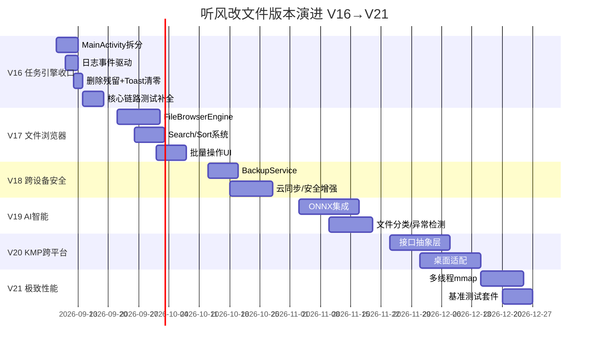

# 听风改文件 (AirFileEditor) 下一步改进指南

> **当前版本**: V15.0.0（versionCode=7，2026-08-26 已发布闭环）
> **目标版本**: V16.0.0 ~ V21.0.0
> **生成日期**: 2026-08-26
> **文档状态**: V3 完整版（以 V15 真实基线重写，替代旧 V2 版）
> **基线证据**: 代码图谱 + 单测 + E2E 模拟器报告 + git 历史（c0b7245）

---

## 目录

- [1. 项目当前真实全景（V15 基线）](#1-项目当前真实全景v15-基线)
- [2. V15 已闭环交付物回顾](#2-v15-已闭环交付物回顾)
- [3. 当前遗留技术债与真实诊断](#3-当前遗留技术债与真实诊断)
- [4. 架构演进路线总览（V16→V21）](#4-架构演进路线总览v16v21)
- [5. V16 — 任务引擎收口与架构减负](#5-v16--任务引擎收口与架构减负)
- [6. V17 — 文件浏览器引擎与存储智能](#6-v17--文件浏览器引擎与存储智能)
- [7. V18 — 跨设备协作与安全增强](#7-v18--跨设备协作与安全增强)
- [8. V19 — AI 智能助手与自动化引擎](#8-v19--ai-智能助手与自动化引擎)
- [9. V20 — 跨平台核心 (KMP) 与桌面适配](#9-v20--跨平台核心-kmp-与桌面适配)
- [10. V21 — 极致性能与实际落地](#10-v21--极致性能与实际落地)
- [11. 持续改进清单与代码清理计划](#11-持续改进清单与代码清理计划)
- [12. 遗留问题与风险矩阵](#12-遗留问题与风险矩阵)
- [13. 附录：执行优先级建议](#13-附录执行优先级建议)

---

## 1. 项目当前真实全景（V15 基线）

### 1.1 当前架构优势（已实测确认）

| 维度 | 现状 | 证据 |
|------|------|------|
| 架构分层 | Clean Architecture + DDD 四层 (`:app → :data → :domain ← :core`) | 模块依赖方向正确，`:domain` 纯 JVM |
| 状态管理 | MVI (Intent/State/ViewModel) + TaskController 接口 | TaskController 已替代 ReplaceProgressManager 全局单例 |
| 任务引擎 | 三个 Orchestrator (Root/Shizuku/Native) + AbstractShellOrchestrator | 基类已消除约 60% 重复 |
| 安全体系 | ArchiveEntryValidator + ArchiveSafetyGuard + AIDL 白名单 + fail-closed | 单测已锁定 |
| 事务保护 | TransactionWalManager 预写日志 + 回滚 | 单测已锁定 |
| 性能引擎 | IoEngine 统一入口 + AdaptiveBufferManager | V15 已融合三策略 |
| 测试体系 | 20 个测试文件，JaCoCo 行≥80%/分支≥70% 门禁 | checkQuality 全绿 |
| 发布能力 | Release APK 签名+混淆，Android 35 模拟器 E2E 验证通过 | apksigner 验证 + uiautomator 层级 |

### 1.2 当前模块规模（代码图谱实测）

| 模块 | 源码文件数 | 关键负载 |
|------|-----------|---------|
| `:app` | 43 个 .kt | MainActivity 822 行（最大负载点） |
| `:core` | 61 个 .kt | IoOptimizer.kt 376 行 / ReplaceProgressManager.kt 85 行残留 |
| `:data` | 3 个 .kt | PreferencesManager / ReplaceHistoryManager |
| `:domain` | 8 个 .kt | 纯 JVM 实体与用例 |
| 图谱 | 144 文件 · 3472 符号 · 1433 边 | 热点：AppLogger(123←)、ReplacingIntent(27←) |

### 1.3 技术栈（以 `gradle/libs.versions.toml` 为准）

Kotlin 2.0.21 · AGP 8.7.3 · JVM 11 · minSdk 26 · target/compileSdk 36 · Compose BOM 2024.10.01
Shizuku 13 · Zip4j 2.11.5 · Commons-Compress 1.26 · WorkManager 2.9 · OkHttp 4.12 · Detekt 1.23.7 · Ktlint 1.2.1 · JaCoCo 0.8.12

---

## 2. V15 已闭环交付物回顾

> 以下均已**真实落地并验证**，非规划项。执行 AI 在 V16+ 时不要重复做这些。

| 类别 | 交付物 | 状态与证据 |
|------|--------|-----------|
| **任务控制** | `TaskController` 接口 (`:domain`) + `TaskControllerImpl` (`:core`) | ✅ 已落地，生产代码不再直接引用 ReplaceProgressManager（仅 `FloatingBallManager` 注释提及） |
| **引擎融合** | `IoEngine` 统一入口（小文件/自适应/mmap 三策略） | ✅ 已落地，IoOptimizer/HighPerformanceIoEngine 能力并入 |
| **Snackbar 统一** | `SnackbarManager` + SnackbarHostWrapper | ✅ 已替换 19 处 Toast；**仅剩 `ArchiveListDialog.kt:L59` 1 处残留** |
| **测试补全** | IoEngine/AdaptiveBufferManager/TransactionWalManager/PathConstants/CopyConfig/ProgressTracker 等 | ✅ 44 个新用例，20 个测试文件，checkQuality 全绿 |
| **ProgressTracker 修复** | 注入 clock 替代 mockkStatic(System) | ✅ 修复栈溢出 |
| **Windows 构建** | 移除 doFirst 清理逻辑 | ✅ 修复 Gradle 文件锁 |
| **鸿蒙适配** | `isHarmonyOS` 3 种检测 + `isHarmonyOSNext` + `isEMUI` | ✅ 已落地（PermissionChecker.kt） |
| **模拟器兼容** | `requestManageStoragePermission` 双层 try-catch 降级 | ✅ 修复 ActivityNotFoundException（commit 4761d9d） |
| **发布能力** | ProGuard 混淆 + release 签名 + 模拟器 E2E | ✅ versionCode=7 / versionName=15.0.0，APK 9.83MB，apksigner 验证通过 |

**E2E 模拟器验证证据（Android 35 x86_64）**：PID 3140 稳定运行 · mCurrentFocus=MainActivity · uiautomator 完整 UI 层级渲染。

---

## 3. 当前遗留技术债与真实诊断

### 3.1 P0 阻塞问题

> 现状：V15 已将大部分 P0 清零。当前**无阻断构建/启动/核心链路的 P0**。以下为 V16 需优先处理的架构级尾巴。

| 问题 | 影响 | 真实状态 |
|------|------|---------|
| **`MainActivity` 822 行超耦合** | UI + 业务 + 权限 + 历史 + 悬浮球 + 日志轮询混杂，难测试、难维护 | V15 未拆分，仍是最大负载点 |
| **`startLogUpdates()` 每秒轮询** | 非事件驱动，浪费电量，UI 刷新不优雅 | 仍存在（MainActivity.kt:L179） |

### 3.2 P1 高优先级问题

| 问题 | 影响 | 真实状态 |
|------|------|---------|
| **`IoOptimizer.kt` 本体残留（376 行）** | 与 IoEngine 能力重复，维护双份 | 生产引用已迁移，但文件本体 + `IoOptimizerTest` 仍存在，**可安全删除** |
| **`ReplaceProgressManager.kt` 本体残留（85 行）** | 全局单例违反 DI | 生产引用已迁移，但文件本体 + `ReplaceProgressManagerTest` 仍存在，**可安全删除** |
| **`ArchiveListDialog` 残留 1 处 Toast** | 与 Snackbar 体系不一致 | ArchiveListDialog.kt:L59 仍用 `Toast.makeText` |
| **核心复制链路端到端测试缺口** | `NormalCopyOrchestrator`/`RootCopyOrchestrator`/`ShizukuCopyOrchestrator` 无独立单测 | 仍有缺口 |

### 3.3 P2 中优先级问题

| 问题 | 影响 | 真实状态 |
|------|------|---------|
| **无国际化支持** | 字符串硬编码，不可本地化，不符 Google Play 要求 | 未开始 |
| **无错误上报** | 崩溃仅本地日志 | 未开始 |
| **无批量操作 UI** | 文件替换/删除/选择需逐个操作 | 未开始 |
| **无主题切换** | 仅随系统深/浅色 | 未开始 |
| **AppLogger 单例** | `object AppLogger`，测试困难 | 图谱热点 123←，重构成本高，低优先级 |
| **PerformanceMonitor 静态初始化** | 耦合 Android 生命周期 | 测试需处理 Android 依赖 |
| **`.kotlin/` 与残留 worktree** | `git status` 出现 `.kotlin/` 未跟踪目录、`.claude/worktrees/` 有历史 agent 副本 | 均为生成物，可清理 |

### 3.4 依赖分析（当前依赖方向）

```
:app (UI) → :data (Repository实现) → :domain (实体/用例/接口) ← :core (基础设施)
                                                                  ↑
                                                    (Shizuku/Worker/Performance/IO/Manager)
```

**依赖方向正确**。残留问题：`:core` 的 IoOptimizer/ReplaceProgressManager 两文件本体待删，`AppLogger` 仍是全局 object 单例。

---

## 4. 架构演进路线总览（V16→V21）

### 4.1 版本路线总览

| 版本 | 主题 | 核心价值 | 风险 | 预估工作量 |
|------|------|---------|------|-----------|
| **V16** | 任务引擎收口 + 架构减负 | 清 V15 尾巴（MainActivity 拆分/日志事件化/删残留），核心链路测试 | L1 | 10-15 天 |
| **V17** | 文件浏览器引擎 + 存储智能 | 文件管理体验质变、批量操作 | L1-L2 | 25-30 天 |
| **V18** | 跨设备协作 + 安全增强 | 数据安全、多设备一致 | L2-L3 | 20-25 天 |
| **V19** | AI 智能助手 + 自动化 | 智能化文件管理 | L2 | 25-30 天 |
| **V20** | 跨平台核心 (KMP) | 多平台覆盖、理论性能极限 | L3 | 30-40 天 |
| **V21** | 极致性能 + 全链路落地 | 性能极限、生产级稳定 | L2 | 15-20 天 |

> **升级原则**：只在现有轮子上改造优化，不重写不重构大文件；每次迭代必须有实质价值，杜绝为升级而升级。

### 4.2 甘特图



---

## 5. V16 — 任务引擎收口与架构减负

> **目标**：清零 V15 遗留尾巴，让架构回到干净基线，为后续大版本铺路。**本版本只做减法与收口，不做新功能。**

### 5.1 MainActivity 拆分（822 → ≤ 400 行）

**真实问题**：MainActivity.kt 822 行，职责混杂（权限检测/模式选择/历史弹窗/悬浮球/日志轮询/主UI）。

**方案（保守，不重构既有布局）**：

| 步骤 | 操作 | 目标文件 | 验收 |
|------|------|---------|------|
| 1 | 提取权限与模式选择逻辑为 `PermissionController` | 新增 `app/ui/PermissionController.kt` | MainActivity 减 ~80 行 |
| 2 | 提取历史记录弹窗为独立 Compose Screen | 新增 `app/ui/HistoryDialog.kt` | 减 ~50 行 |
| 3 | 提取悬浮球生命周期为 `FloatingBallController` | 新增 `app/ui/FloatingBallController.kt` | 减 ~40 行 |
| 4 | 提取更新检查/日志管理为 `MainLifecycleCoordinator` | 新增 `app/ui/MainLifecycleCoordinator.kt` | 减 ~60 行 |
| 5 | 复用既有 Compose 组件（PermissionCard/MainDashboard/MainPackCard/LogConsole） | MainActivity 保留接线 | ≤ 400 行 |

**红线**：不重写 ViewBinding/DataBinding 混合布局，不重构既有 Compose 组件，只做"提取委派"。

### 5.2 日志轮询改事件驱动

**真实问题**：`startLogUpdates()` 每秒 `AppLogger.getRecentLogs(50)` 轮询，浪费电量、刷新不优雅。

**方案**：`AppLogger` 暴露 `SharedFlow<List<LogEntry>>` 事件流（增量推送），LogConsole 组件订阅而非轮询。保留 `getRecentLogs` 兼容旧调用。

```kotlin
// AppLogger 新增（不改原结构，只加流）
object AppLogger {
    private val _logFlow = MutableSharedFlow<LogEntry>(extraBufferCapacity = 200)
    val logFlow: SharedFlow<LogEntry> = _logFlow.asSharedFlow()
}
```

### 5.3 删除残留 + Toast 清零

| 清理项 | 文件 | 处理 | 验收 |
|--------|------|------|------|
| IoOptimizer 本体 | `core/utils/IoOptimizer.kt`（376 行） | 确认无生产引用后删除，同步删 `IoOptimizerTest`（迁移断言到 IoEngineTest） | `grep IoOptimizer` 0 命中 |
| ReplaceProgressManager 本体 | `core/manager/ReplaceProgressManager.kt`（85 行） | 确认无生产引用后删除，同步删测试 | `grep ReplaceProgressManager` 0 命中 |
| Toast 残留 | `ArchiveListDialog.kt:L59` | 改为 `SnackbarManager.show()` | `grep Toast.makeText` 0 命中 |
| `.kotlin/` 未跟踪目录 | 项目根 | 加入 `.gitignore` | git status 干净 |

### 5.4 核心复制链路测试补全

| 测试目标 | 内容 | 优先级 | 预估用例 |
|---------|------|--------|---------|
| `NormalCopyOrchestrator` | 端到端复制、并发控制、异常、验证 | P0 | 8-10 |
| `RootCopyOrchestrator` | 命令构建、路径安全、看门狗超时 | P0 | 6-8 |
| `ShizukuCopyOrchestrator` | 命令构建、IPC 延迟、连接超时 | P0 | 6-8 |
| `TaskControllerImpl` | 状态机 7 态、终态、reset/fail/cancel | P0 | 6-8 |

测试基础设施：优先手写 `FakeFileSystem` / `FakeTaskController` / `FakeProcess`，MockK 兜底。

### 5.5 V16 交付清单

| 模块 | 任务 | 验收标准 |
|------|------|---------|
| MainActivity | 提取委派 | ≤ 400 行 |
| 日志 | 事件驱动推送 | 无每秒轮询 |
| 清理 | 删残留 + Toast 清零 | grep 0 命中 |
| 测试 | 三 Orchestrator + TaskControllerImpl | 新增 25+ 用例 |
| 质量门禁 | checkQuality | 全绿，行覆盖 ≥ 80% |

---

## 6. V17 — 文件浏览器引擎与存储智能

### 6.1 核心目标

构建文件浏览器引擎，实现目录浏览/搜索/排序/批量操作，让用户从"选包-替换"升级到"可视化管理"。

### 6.2 FileBrowserEngine

```kotlin
// core/manager/FileBrowserEngine.kt
class FileBrowserEngine(
    private val mode: AccessMode,
    private val shizukuManager: ShizukuManager? = null,
) {
    suspend fun listDirectory(path: String): Result<List<FileInfo>>
    suspend fun searchFiles(root: String, query: String): Flow<FileInfo>
    suspend fun getFileInfo(path: String): Result<FileInfo>
    suspend fun deleteFile(path: String): Result<Unit>
    suspend fun renameFile(path: String, newName: String): Result<Unit>
    suspend fun copyFile(src: String, dst: String): Result<Unit>
}
```

**技术要点**：
- 复用 `IoEngine` 做复制、复用 `PathConstants.resolveTargetFile`/`isSafeTargetPath` 做路径安全
- 目录缓存 `DirectoryCache`（30s TTL），避免重复 IO
- 搜索用前缀树 `Trie` 增量索引，O(k) 查询

### 6.3 批量操作 UI + 搜索排序

- `BatchOperationBar`：多选后批量复制/删除/替换/压缩
- 搜索模式：名称/扩展名/大小/日期/组合
- 排序：名称/大小/修改时间，点击表头切换

### 6.4 国际化（P2 首项）

将硬编码字符串迁移到 `res/values-zh/strings.xml` + 默认英文，为 Google Play 上架做准备。**建议 V17 同步做**。

### 6.5 V17 交付清单

| 模块 | 任务 | 验收标准 |
|------|------|---------|
| FileBrowserEngine | 目录浏览+文件操作 | 可浏览 Android/data/obb |
| 搜索系统 | 多维度搜索 | 响应 < 500ms |
| 排序 | 多维度排序 | 点击表头切换 |
| 批量操作 | 多选+批量复制/删除/替换 | 5 次操作验证 |
| 国际化 | 字符串资源化 | 中英切换无硬编码残留 |

---

## 7. V18 — 跨设备协作与安全增强

### 7.1 核心目标

备份同步 + 安全强化，解决"替换前无备份、恢复困难、配置无法跨设备"。

### 7.2 备份同步

- **本地备份**：替换前自动备份原始文件到 `Android/data/包名/backups/`，用 `TransactionWalManager` 保护
- **云备份**：可选同步 Google Drive / 本地 NAS
- **备份管理**：查看/恢复/删除，MD5 完整性

```kotlin
interface BackupService {
    suspend fun createBackup(sourcePath: String, tag: String): Result<BackupInfo>
    suspend fun restoreBackup(backupId: String): Result<Unit>
    suspend fun listBackups(): Result<List<BackupInfo>>
    suspend fun deleteBackup(backupId: String): Result<Unit>
}
```

### 7.3 安全增强

| 增强点 | 技术方案 | 优先级 |
|--------|---------|--------|
| WAL 文件加密 | AES-GCM 256，密钥存 Android KeyStore | P1 |
| 传输校验 | 大文件分片 SHA-256 校验 | P2 |
| 密码管理器 | EncryptedSharedPreferences 管理压缩包密码 | P1 |
| 审计日志 | 签名日志 + 防回滚 | P2 |

### 7.4 V18 交付清单

| 模块 | 任务 | 验收标准 |
|------|------|---------|
| 本地备份 | 备份/恢复/管理 | 100 文件全量恢复 |
| 云同步 | 可选云端 | 新设备可恢复 |
| WAL 加密 | AES-GCM | 加密不可读，解密完整 |
| 密码管理 | 压缩包密码 | 10 个密码存储 |
| 审计日志 | 签名+防回滚 | 日志不可篡改 |

---

## 8. V19 — AI 智能助手与自动化引擎

### 8.1 核心目标

集成端侧 AI，智能分类/异常检测/自动规则，提升"傻瓜式"体验。

### 8.2 端侧 AI 选型

| 方案 | 优势 | 劣势 | 选择 |
|------|------|------|------|
| ML Kit | 无需额外依赖 | 能力有限 | ❌ |
| MediaPipe | 跨平台 | 需模型文件 | ❌ |
| **ONNX Runtime** | 多框架、Android 优化好 | APK +5MB | ✅ 推荐 |
| PyTorch Mobile | 灵活 | APK +10MB | ❌ |

**落地**：模型按需下载不内置（避免 APK 膨胀）；推理时延目标 < 100ms。

### 8.3 应用场景

1. **智能包名识别** `SmartPackageDetector` — 从路径/内容识别游戏包名
2. **文件分类器** `FileClassifier` — 6 类（资源/配置/缓存/数据/媒体/归档），按扩展名快路径 + 文件头校验
3. **异常检测** `AnomalyDetector` — 基于历史成功/失败比例、文件大小/路径异常
4. **推荐引擎** `SmartRecommendationEngine` — 推荐最佳访问模式/缓冲区
5. **自动化规则引擎** `AutomationRule` — 触发(AppLaunch/TimeSchedule/FileChange/Manual) × 条件 × 动作(AutoReplace/CleanupCache/Backup/Notify)

### 8.4 V19 交付清单

| 模块 | 任务 | 验收标准 |
|------|------|---------|
| ONNX 集成 | 模型加载+推理 | 时延 < 100ms |
| 文件分类 | 6 类识别 | 准确率 > 90% |
| 异常检测 | 异常替换模式 | 召回率 > 85% |
| 推荐引擎 | 最优模式/缓冲区 | 时延 < 50ms |
| 规则引擎 | 创建/编辑/删除/执行 | 5 种规则可执行 |

---

## 9. V20 — 跨平台核心 (KMP) 与桌面适配

### 9.1 核心目标

将核心业务抽取为 KMP 跨平台库，支持桌面（Windows/macOS）。

### 9.2 架构

```
tfgwj-core/
├── commonMain/   io/ security/ archive/ model/
├── androidMain/  NIO + FileSystem + MessageDigest
├── desktopMain/  java.nio.file + transferTo
└── iosMain/      NSFileManager + CommonCrypto
```

```kotlin
expect class PlatformFileSystem {
    fun listDirectory(path: String): List<FileInfo>
    fun copyFile(source: String, target: String): Boolean
    fun deleteFile(path: String): Boolean
}
```

### 9.3 落地顺序

1. 先分离接口（commonMain），再实现平台代码（逐平台编译验证）
2. Android 实现迁移现有代码，功能 100% 保留
3. 桌面 UI 用 Compose Desktop 复用大部分组件

### 9.4 V20 交付清单

| 模块 | 任务 | 验收标准 |
|------|------|---------|
| 接口抽象 | commonMain | 3 平台编译通过 |
| Android 实现 | 现有代码迁移 | 功能 100% 保留 |
| 桌面实现 | Windows/macOS IO | 复制/删除/重命名可用 |
| 桌面 UI | Compose Desktop | 可浏览文件列表 |

---

## 10. V21 — 极致性能与实际落地

### 10.1 优化目标（第一性原理拆解）

| 优化项 | 当前 | 目标 | 方法 |
|--------|------|------|------|
| 文件复制 | ~100MB/s (UFS3.1) | ~200MB/s | 多线程 mmap + 异步预取 |
| 解压速度 | 7z>50MB/s | 7z>80MB/s | 多线程解压 + 预读 |
| 内存峰值 | 150MB | ≤100MB | 分页缓冲 + 弱引用缓存 |
| 冷启动 | ~500ms | ≤200ms | 延迟初始化 + 懒加载 |
| 哈希检测 | 抽样哈希 | 快速预检 | 前4KB+大小+时间组合 |

### 10.2 多线程 mmap

每个线程独立 mmap 各自分片，`Executors.newFixedThreadPool(cores)` 并行，先单线程验证再扩多线程防竞态。

### 10.3 基准测试套件

`IoEngineBenchmark` 覆盖 mmap 复制/抽样哈希/解压/启动，用 `nanoTime` 断言阈值。

### 10.4 V21 交付清单

| 优化项 | 验收标准 |
|--------|---------|
| 多线程 mmap | 复制 ≥ 200MB/s |
| 解压优化 | 7z ≥ 80MB/s |
| 内存优化 | 峰值 ≤ 100MB |
| 启动优化 | 冷启动 ≤ 200ms |
| 基准测试 | 10 项全通过 |

---

## 11. 持续改进清单与代码清理计划

### 11.1 质量门禁演进

| 门禁 | V15 基线 | V16 目标 | V19 目标 | V21 目标 |
|------|---------|---------|---------|---------|
| 行覆盖率 | 80% | 80% | 90% | 92% |
| 分支覆盖率 | 70% | 70% | 80% | 85% |
| 函数最大行数 | 50 | 45 | 40 | 35 |
| 文件最大行数 | 800 | 600 | 500 | 400 |
| Detekt 基线 | 有基线 | ≤80 项 | ≤40 项 | ≤20 项 |
| Ktlint | 有基线 | 零容忍 | 零容忍 | 零容忍 |

### 11.2 代码清理计划（清理旧产物/屎山）

| 清理项 | 位置 | 处理 | 版本 |
|--------|------|------|------|
| `IoOptimizer.kt`（376 行） | `core/utils/` | 删除本体+测试（能力已在 IoEngine） | V16 |
| `ReplaceProgressManager.kt`（85 行） | `core/manager/` | 删除本体+测试（能力已在 TaskController） | V16 |
| 残留 Toast | `ArchiveListDialog.kt` | 替换为 SnackbarManager | V16 |
| `.kotlin/` 未跟踪目录 | 项目根 | 加入 `.gitignore` | V16 |
| `.claude/worktrees/` 历史副本 | `.claude/` | 清理已合并的 agent worktree | V16 |
| `AppLogger` 单例 | `core/utils/` | 抽事件流；整体 DI 化属低优先级 | V17+ |
| `MainActivity` 822 行 | `app/` | 拆分委派 | V16 |

### 11.3 依赖升级建议（经评估，按需升级，勿盲目追新）

| 依赖 | 当前 | 建议 | 原因 | 版本 |
|------|------|------|------|------|
| Kotlin | 2.0.21 | 2.1.x | 性能与新特性 | V17 |
| AGP | 8.7.3 | 8.8.x | 构建性能 | V17 |
| Compose BOM | 2024.10.01 | 2025.x | 性能修复 | V16 |
| Shizuku | 13.0.0 | 14.x | 新 API | V17 |
| WorkManager | 2.9.0 | 2.10.x | 新特性 | V17 |
| OkHttp | 4.12.0 | 5.x | Kotlin 原生 | V18 |

---

## 12. 遗留问题与风险矩阵

### 12.1 已知技术债

| 债务 | 影响 | 建议版本 | 工作量 |
|------|------|---------|--------|
| MainActivity 822 行 | 高耦合难测试 | V16 | 3-5 天 |
| startLogUpdates 轮询 | 资源浪费 | V16 | 1 天 |
| IoOptimizer/ReplaceProgressManager 残留 | 代码重复 | V16 | 1 天 |
| 核心 Orchestrator 无端到端测试 | 回归风险 | V16 | 3 天 |
| 无国际化 | 不可本地化 | V17 | 2 天 |
| AppLogger 单例 | 测试困难 | V17+ | 低优先 |
| 无错误上报 | 难发现用户端问题 | V18 | 2 天 |

### 12.2 风险矩阵

| 风险 | 概率 | 影响 | 缓解 |
|------|------|------|------|
| MainActivity 拆分破坏现有 UI | 中 | 中 | 只提取委派，保留布局，逐步迁移 |
| 删残留误删引用 | 中 | 中 | 删除前全局 grep 确认 0 命中 |
| 日志事件驱动回归 | 低 | 低 | 保留 getRecentLogs 兼容 |
| KMP 跨平台兼容 | 中 | 高 | 先分离接口再逐平台实现 |
| AI 端侧模型 APK 膨胀 | 低 | 中 | 按需下载不内置 |
| 多线程 mmap 竞态 | 中 | 高 | 先单线程验证再扩多线程 |

---

## 13. 附录：执行优先级建议

### 第一阶段（V16 核心 — 10-15 天）

```
高优先级（P0）：
  1. MainActivity 拆分委派（5 天）
  2. 日志改事件驱动（3 天）
  3. 删除 IoOptimizer/ReplaceProgressManager 残留 + Toast 清零（2 天）
  4. 核心链路测试补全（5 天）

清理（随 V16 一并）：
  5. .kotlin/ 入 gitignore，清理残留 worktree
```

### 第二阶段（V17-V21 — 持续迭代）

```
V17 (25-30 天): 文件浏览器 → 搜索排序 → 批量操作 → 国际化
V18 (20-25 天): 备份系统 → 云同步 → 安全增强 → 审计日志
V19 (25-30 天): ONNX 集成 → 文件分类 → 异常检测 → 规则引擎
V20 (30-40 天): KMP 接口抽象 → Android 迁移 → 桌面适配
V21 (15-20 天): 多线程 mmap → 解压优化 → 内存优化 → 基准测试
```

### 执行铁则（给执行 AI）

1. **只改必须改的**，不重写不重构大文件，在既有轮子上改造
2. **真实闭环**：每项必须有可运行代码 + 可复现验证，禁止假实现
3. **TDD**：先写测试（RED）→ 实现（GREEN）→ 重构
4. **验证**：每个版本跑 `gradlew.bat :app:checkQuality` + 相关单测 + 模拟器 E2E
5. **覆盖**：核心逻辑覆盖正常/错误/边界/权限路径，达标即停不为数字追覆盖
6. **清理**：升级完删旧产物，保持仓库干净

---

> **文档版本**: 3.0
> **最后更新**: 2026-08-26
> **适用版本范围**: V15.0.0（当前）→ V21.0.0
> **文档状态**: 终版 · 基于真实代码证据（图谱/单测/E2E/git）
> **前置文档**: `docs/plans/V15-发布构建配置.md` · `docs/reports/v15-change-report.html` · `docs/reports/v15-e2e-emulator.html`
