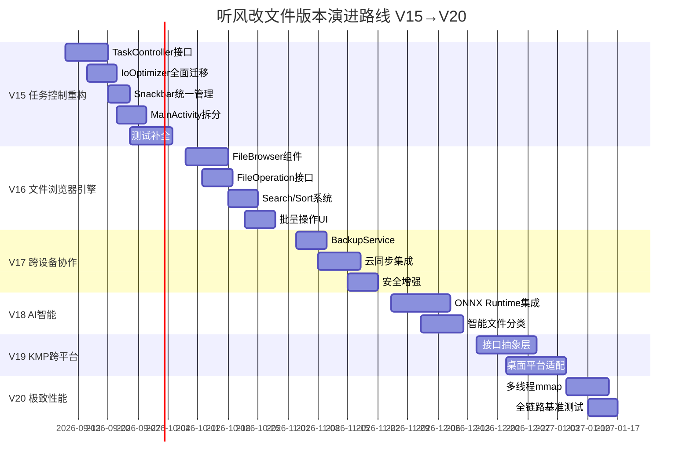

# 听风改文件 (AirFileEditor) 下一步改进指南

> **当前版本**: V14.1.0（引擎融合与 UI 飞跃）
> **目标版本**: V15.0.0 ~ V20.0.0
> **生成日期**: 2026-08-25
> **文档状态**: V2 完整版

---

## 目录

- [1. 项目当前全景分析](#1-项目当前全景分析)
- [2. V14 已完成工作回顾](#2-v14-已完成工作回顾)
- [3. 核心问题深度诊断（当前真实状态）](#3-核心问题深度诊断当前真实状态)
- [4. 架构演进路线总览](#4-架构演进路线总览)
- [5. V15 — 任务控制重构与功能完整闭环](#5-v15--任务控制重构与功能完整闭环)
- [6. V16 — 文件浏览器引擎与存储智能](#6-v16--文件浏览器引擎与存储智能)
- [7. V17 — 跨设备协作与安全增强](#7-v17--跨设备协作与安全增强)
- [8. V18 — AI 智能助手与自动化引擎](#8-v18--ai-智能助手与自动化引擎)
- [9. V19 — 跨平台核心 (KMP) 与桌面适配](#9-v19--跨平台核心-kmp-与桌面适配)
- [10. V20 — 极致性能与实际落地](#10-v20--极致性能与实际落地)
- [11. 持续改进清单与代码清理计划](#11-持续改进清单与代码清理计划)
- [12. 遗留问题与风险矩阵](#12-遗留问题与风险矩阵)
- [13. 附录：文件变更清单](#13-附录文件变更清单)

---

## 1. 项目当前全景分析

### 1.1 当前架构优势

| 维度 | 现状 | 评价 |
|------|------|------|
| 架构分层 | Clean Architecture + DDD 四层 (`:app → :data → :domain ← :core`) | ✅ 优秀，依赖方向正确 |
| 状态管理 | MVI 模式 (Intent/State/ViewModel) | ✅ 成熟，单事件总线已实现 |
| 任务引擎 | 三个 Orchestrator (Root/Shizuku/Native) | ✅ 职责清晰，AbstractShellOrchestrator 消除重复 |
| 安全体系 | ArchiveEntryValidator + ArchiveSafetyGuard + AIDL 白名单 | ✅ 完善，fail-closed 机制 |
| 事务保护 | TransactionWalManager 预写日志 + 回滚 | ✅ 崩溃安全 |
| 性能引擎 | IoEngine 统一入口 + AdaptiveBufferManager | ✅ V14 已融合，三种策略自动选择 |
| 测试体系 | 21 个测试文件，JaCoCo 80% 行覆盖/70% 分支覆盖 | ✅ 良好基础 |

### 1.2 当前版本状态（V14.1.0）

#### 已完成的 V14 核心交付物

| 类别 | 交付物 | 状态 |
|------|--------|------|
| **引擎融合** | IoEngine 统一入口（小文件/自适应/mmap 三种策略） | ✅ 已落地 |
| **架构** | AbstractShellOrchestrator 基类提取，消除 60% 重复代码 | ✅ 已落地 |
| **UI 主题** | OKLCH 色彩空间 + TfgwjShapes + TfgwjAnimation 系统 | ✅ 已落地 |
| **组件** | SkeletonLoader / AnimatedButton / EmptyStateView | ✅ 已创建并接线 |
| **历史 UI** | HistoryScreen + HistoryViewModel + 列表/详情/删除/清空 | ✅ 已落地 |
| **测试** | IoEngineTest (10+ 用例) + ProgressTrackerTest + 历史 ViewModel 测试 | ✅ 已落地 |
| **质量门禁** | checkQuality (Detekt + Ktlint + JaCoCo) 全绿通过 | ✅ 已落地 |
| **构建稳定** | Windows 文件锁缓解 + 可重复构建 | ✅ 已落地 |

---

## 2. V14 已完成工作回顾

### 2.1 IoEngine 统一引擎

**文件**: `core/performance/IoEngine.kt`

三种策略自动选择：
- 极小文件 (< 32KB) → 直接缓冲区复制，避免 mmap 页表开销
- 大文件 (>= 16MB) → mmap 零拷贝，Semaphore(16) 限流
- 常规文件 → 自适应缓冲区流，配合 AdaptiveBufferManager 动态调优

增量检测策略：
- 文件不存在/大小不同 → 需要更新
- 修改时间一致 → 跳过（大概率相同）
- 小文件 (< 5MB) → 全量 MD5 比对
- 大文件 (>= 5MB) → 三段抽样哈希（首/中/尾）

### 2.2 AbstractShellOrchestrator 基类

**文件**: `core/worker/orchestrator/AbstractShellOrchestrator.kt`

通用实现：
- 看门狗协程（watchdog）
- 并发控制（processWithAdaptiveLimit）
- 路径安全校验（isSafeTargetPath）
- Shell 转义（shellEscape）
- 文件名提取（extractFileNameFromCpOutput）

### 2.3 UI 主题系统

| 文件 | 内容 |
|------|------|
| `Color.kt` | OKLCH 色彩空间 + 品牌色 + 语义色 + SurfacePalette |
| `TfgwjShapes.kt` | 卡片/按钮/对话框/芯片/底部表单形状 |
| `TfgwjAnimation.kt` | 快速/正常/慢速动画 + 缓动函数 + 弹簧动画 |
| `Theme.kt` | 集成 Shape 和 Animation 系统到 MD3 |

### 2.4 组件与历史 UI

| 组件 | 用途 | 接线状态 |
|------|------|---------|
| SkeletonLoader | 数据加载时骨架屏 | ✅ MainDashboard 已接线 |
| AnimatedButton | 带动画/加载状态的按钮 | ✅ 关键按钮已接线 |
| EmptyStateView | 空数据展示 | ✅ PatchVersionCard 已接线 |
| HistoryScreen | 替换历史记录全屏 | ✅ 已接入 MainActivity |

---

## 3. 核心问题深度诊断（当前真实状态）

### 3.1 P0 阻塞问题

| 问题 | 影响 | 分析 |
|------|------|------|
| **ReplaceProgressManager 全局单例** | 全局 `object`，`:core` 模块硬引用，6 个文件直接依赖 | ViewModel 在 `:app` 中直接引用 `ReplaceProgressManager.progressState`，违反 Clean Architecture。Worker、Strategy、ConfigRepositoryImpl 均硬引用，测试困难 |
| **IoOptimizer 仍被大量使用** | IoEngine 已创建但 IoOptimizer 未被废弃 | `ExtractManager`、`UniversalExtractor`、`PatchManager`、`NormalCopyStrategy` 仍直接使用 `IoOptimizer.acquireBuffer()`、`IoOptimizer.fastCopy()`、`IoOptimizer.needsUpdate()`、`IoOptimizer.parallelProcess()`。IoOptimizer 375 行代码与 IoEngine 重复 |
| **MainActivity 827 行** | 混合 UI 逻辑、业务逻辑、权限处理、历史记录弹窗 | 提取 Compose Screen 可大幅减少，但需注意不破坏现有 ViewBinding/DataBinding 混合布局 |

### 3.2 P1 高优先级问题

| 问题 | 影响 | 分析 |
|------|------|------|
| **测试覆盖严重缺口** | 21 个测试文件，但核心复制链路缺少测试 | `NormalCopyOrchestrator`、`RootCopyOrchestrator`、`ShizukuCopyOrchestrator` 端到端测试缺失；`TransactionWalManager` 只有简单测试；`VerificationManager`、`FileStatistics`、`CopyConfig` 无测试 |
| **IoOptimizer 残留引用** | 6 个文件仍引用 `IoOptimizer` | `ExtractManager` 使用缓冲区池、`UniversalExtractor` 使用缓冲区池、`PatchManager` 使用 `fastCopy`/`parallelProcess`/`needsUpdate`、`NormalCopyStrategy` 使用 `fastCopy` |
| **日志轮询模式** | `startLogUpdates()` 每秒轮询，非事件驱动 | 浪费电量，UI 刷新周期不优雅。LogConsole 组件已存在但数据推送方式落后 |
| **硬编码 Toast** | 大量 `Toast.makeText()` 直接使用 | 无统一 Snackbar 管理器，用户体验不一致，不可批量控制 |
| **权限检测冗余** | `checkAllPermissions()` 在 `onCreate` 和 `onResume` 都调用 | 启动时不必要的重复检测 |

### 3.3 P2 中优先级问题

| 问题 | 影响 | 分析 |
|------|------|------|
| **无国际化支持** | 所有字符串硬编码在 Kotlin 代码中 | 不可本地化，不符合 Google Play 发布要求 |
| **无错误报告机制** | 崩溃信息仅本地日志 | 无远程错误收集，难以发现用户端问题 |
| **无批量操作 UI** | 文件选择/替换/删除无批量操作 | 用户需逐个操作，效率低 |
| **无主题切换** | 仅支持系统深色/浅色 | 无手动切换，无动态主题 |
| **AppLogger 单例** | `object AppLogger` 全局单例 | 测试困难，无法注入 Mock |
| **PerformanceMonitor 静态初始化** | 耦合 Android 生命周期 | 测试时需处理 Android 依赖 |

### 3.4 P3 增强建议

| 建议 | 说明 |
|------|------|
| 文件浏览器 | 浏览 Android/data/obb 目录结构 |
| 搜索过滤 | 按文件名/大小/时间/类型搜索文件 |
| 排序功能 | 支持名称/大小/修改时间排序 |
| 增量更新 UI | 显示哪些文件被跳过、哪些被更新 |
| 定时任务 | 计划任务自动执行替换 |
| 批量重命名 | 批量修改文件名 |
| 文件校验 | 完整性校验（CRC32/SHA256） |
| 主题商店 | 下载/切换主题配色 |

### 3.5 依赖分析

```
:app (UI) → :data (Repository实现) → :domain (实体/用例/接口) ← :core (基础设施)
                                                                  ↑
                                                            (Shizuku/Worker/Performance/IO引擎/Manager)
```

**依赖方向正确**，但存在以下问题：
- `:core` 中 `ReplaceProgressManager` 被 `:data` 和 `:app` 直接引用，是全局单例而非接口注入
- `IoOptimizer` 在 `:core` 内部被多个 Manager 硬引用，应统一委派到 IoEngine
- `:core` 的 `ExtractManager`、`UniversalExtractor` 使用 `IoOptimizer.acquireBuffer()` 获取缓冲区，应改为 IoEngine 或 AdaptiveBufferManager

---

## 4. 架构演进路线总览

### 4.1 版本路线总览



### 4.2 版本对应关系

| 版本 | 主题 | 核心价值 | 风险等级 | 预估工作量 |
|------|------|---------|---------|-----------|
| V15 | 任务控制重构 + 功能完整闭环 | 消除 P0 技术债，功能完整闭环 | L1 | 30-40 天 |
| V16 | 文件浏览器引擎 + 存储智能 | 文件管理体验质变，批量化操作 | L1-L2 | 25-30 天 |
| V17 | 跨设备协作 + 安全增强 | 数据安全，多设备一致体验 | L2-L3 | 20-25 天 |
| V18 | AI 智能助手 + 自动化 | 智能化文件管理体验 | L2 | 25-30 天 |
| V19 | 跨平台核心 (KMP) | 理论性能极限，多平台覆盖 | L3 | 30-40 天 |
| V20 | 极致性能 + 全链路优化 | 性能极限，生产级稳定性 | L2 | 15-20 天 |

---

## 5. V15 — 任务控制重构与功能完整闭环

### 5.1 核心目标

消除 P0 技术债（ReplaceProgressManager 全局单例、IoOptimizer 残留引用），补全测试覆盖，完成 MainActivity 拆分，统一 Snackbar 管理。

### 5.2 TaskController 接口提取

#### 问题分析

`ReplaceProgressManager` 当前是 `object` 全局单例，被 6 个文件和测试直接引用：

| 引用文件 | 模块 | 使用方式 |
|---------|------|---------|
| `FileReplaceWorkerV2.kt` | `:core` | cancel/reset/startMeasure/updateState/finish/fail |
| `NormalCopyStrategy.kt` | `:core` | finish |
| `RootCopyStrategy.kt` | `:core` | reset/startMeasure/finish |
| `ShizukuCopyStrategy.kt` | `:core` | reset/startMeasure/finish |
| `ConfigRepositoryImpl.kt` | `:data` | cancel/reset/getTaskProgress |
| `MainActivity.kt` | `:app` | progressState.collectAsState |
| `MainViewModel.kt` | `:app` | progressState.collect |
| `FloatingBallManager.kt` | `:app` | progressState.collectLatest |

#### 建议方案：引入 TaskController 接口

**Phase 1: 定义接口（`:domain` 层）**

```kotlin
// domain/src/main/java/.../domain/repository/TaskController.kt
interface TaskController {
    val state: Flow<TaskState>
    fun start(config: TaskConfig): Result<Unit>
    suspend fun cancel(): Result<Unit>
    suspend fun dismiss(): Result<Unit>
    fun updateProgress(processed: Int, total: Int, currentFile: String, progress: Int, speed: Float, phase: TaskPhase)
    fun finish()
    fun fail(message: String)
    fun reset()
}

data class TaskState(
    val processed: Int = 0,
    val total: Int = 0,
    val progress: Int = 0,
    val currentFile: String = "",
    val speed: Float = 0f,
    val phase: TaskPhase = TaskPhase.IDLE,
    val errorMessage: String? = null,
) {
    val isReplacing: Boolean get() = phase in listOf(TaskPhase.PREPARING, TaskPhase.REPLACING, TaskPhase.VERIFYING)
    val isTerminal: Boolean get() = phase in listOf(TaskPhase.COMPLETED, TaskPhase.FAILURE, TaskPhase.CANCELLED)
}

data class TaskConfig(
    val targetPackage: String,
    val sourceDir: File,
    val accessMode: AccessMode,
    val isObb: Boolean = false,
)
```

**Phase 2: 实现（`:core` 层）**

```kotlin
// core/src/main/java/.../worker/TaskControllerImpl.kt
class TaskControllerImpl : TaskController {
    private val _state = MutableStateFlow(TaskState())
    override val state: Flow<TaskState> = _state.asStateFlow()

    // 全部委托到内部 MutableStateFlow
    // ...
}
```

**Phase 3: 迁移路径**

1. 新建 `TaskController` 接口和 `TaskControllerImpl`
2. `ConfigRepository` 中 `getTaskProgress()` 改为从 `TaskController` 获取
3. `FileReplaceWorkerV2` 注入 `TaskController` 而非直接引用 `ReplaceProgressManager`
4. 三策略类（NormalCopyStrategy/RootCopyStrategy/ShizukuCopyStrategy）注入 `TaskController`
5. 全部代码迁移完成后，标记 `ReplaceProgressManager` 为 `@Deprecated`，后续删除

### 5.3 IoOptimizer 全面迁移到 IoEngine

#### 问题分析

`IoOptimizer` 375 行代码中，仍有以下功能被外部引用：

| 功能 | 被引用位置 | 迁移方式 |
|------|-----------|---------|
| `IoOptimizer.acquireBuffer()` | `ExtractManager`、`UniversalExtractor` | 改为直接使用 `IoEngine.bufferManager.acquireBuffer()` |
| `IoOptimizer.releaseBuffer()` | `ExtractManager`、`UniversalExtractor` | 改为直接使用 `IoEngine.bufferManager.releaseBuffer()` |
| `IoOptimizer.fastCopy()` | `NormalCopyStrategy`、`PatchManager` | 改为 `IoEngine.fastCopy()` |
| `IoOptimizer.needsUpdate()` | `PatchManager` | 改为 `IoEngine.needsUpdate()` |
| `IoOptimizer.parallelProcess()` | `PatchManager` | 改为 `IoEngine.parallelProcess()` |
| `IoOptimizer.getOptimalBufferSize()` | `ExtractManager.bufferSize`、`UniversalExtractor.bufferSize` | 改为 `AdaptiveBufferManager.getCurrentBufferSize()` |

#### 迁移计划

1. 让 `IoEngine.bufferManager` 暴露 `acquireBuffer()` / `releaseBuffer()` 方法
2. 依次迁移 `ExtractManager` → `UniversalExtractor` → `PatchManager` → `NormalCopyStrategy`
3. 每个迁移完成后运行测试确认
4. 全部迁移完成后删除 `IoOptimizer.kt`

#### 缓冲区管理增强

当前 `IoEngine` 的缓冲区池使用 `ConcurrentLinkedQueue<ByteArray>`，存在以下问题：
- 缓冲区大小固定（从 `AdaptiveBufferManager` 获取），但文件大小变化时可能浪费内存
- 无超时释放机制，长时间运行可能持有过多缓冲区

**改进方案**：引入 `AdaptiveBufferPool`

```kotlin
class AdaptiveBufferPool(
    private val minSize: Int = 32 * 1024,      // 32KB
    private val maxSize: Int = 4 * 1024 * 1024, // 4MB
    private val poolSize: Int = 8,
) {
    // 根据文件大小自动选择合适大小的缓冲区
    // 大文件用大缓冲区，小文件用小缓冲区
    // 闲置超过 30s 的缓冲区自动释放
}
```

### 5.4 MainActivity 拆分

#### 当前问题

`MainActivity.kt` 827 行，包含：
- 权限检测逻辑（~80 行）
- 模式选择逻辑（~60 行）
- 历史记录弹窗逻辑（~50 行）
- 悬浮球管理（~40 行）
- 日志轮询（~30 行）
- 主 UI 布局和事件处理（~500 行）

#### 建议方案

**Phase 1: 提取 Compose Screen（低风险）**

将可 Compose 化的部分提取为独立 Screen：

```kotlin
// 新增 MainScreen.kt（Compose 版本，逐步替代 ViewBinding）
@Composable
fun MainScreen(viewModel: MainViewModel, onNavigate: (Screen) -> Unit) { ... }

// 新增 HistoryScreen.kt（已存在，整合到 Navigation）
// 新增 SettingsScreen.kt
@Composable
fun SettingsScreen(onNavigate: (Screen) -> Unit) { ... }
```

**Phase 2: 引入 Navigation Compose**

```kotlin
sealed class Screen(val route: String) {
    object Main : Screen("main")
    object History : Screen("history")
    object Settings : Screen("settings")
    data class HistoryDetail(val timestamp: Long) : Screen("history/{timestamp}")
}

@Composable
fun AppNavigation() {
    val navController = rememberNavController()
    NavHost(navController, startDestination = Screen.Main.route) {
        composable(Screen.Main.route) { MainScreen(...) }
        composable(Screen.History.route) { HistoryScreen(...) }
        composable(Screen.Settings.route) { SettingsScreen(...) }
    }
}
```

**Phase 3: 保留 ViewBinding 兼容**

将 ViewBinding 布局作为 `MainScreen` 内的一个 `AndroidView` 嵌入，逐步迁移：
1. 先用 Compose 包裹 ViewBinding 布局
2. 逐步将 ViewBinding 布局中的组件替换为 Compose 组件
3. 全部替换后删除 ViewBinding 布局文件

### 5.5 统一 Snackbar 管理

#### 问题分析

当前代码中散布 `Toast.makeText()` 调用，至少有 20+ 处。

#### 建议方案

```kotlin
// app/src/main/java/.../ui/components/molecules/SnackbarManager.kt
object SnackbarManager {
    private val _events = MutableSharedFlow<SnackbarEvent>(extraBufferCapacity = 10)
    val events: SharedFlow<SnackbarEvent> = _events.asSharedFlow()

    fun show(message: String, action: SnackbarAction? = null, duration: SnackbarDuration = SnackbarDuration.SHORT)
    fun showError(message: String, action: SnackbarAction? = null)
    fun showSuccess(message: String)
}

sealed class SnackbarEvent(
    val message: String,
    val action: SnackbarAction? = null,
    val duration: SnackbarDuration = SnackbarDuration.SHORT,
)

enum class SnackbarDuration { SHORT, LONG, INDEFINITE }

data class SnackbarAction(val label: String, val onClick: () -> Unit)
```

然后在 Compose 根节点添加：

```kotlin
@Composable
fun SnackbarHost(snackbarManager: SnackbarManager) {
    val snackbarHostState = remember { SnackbarHostState() }
    LaunchedEffect(Unit) {
        snackbarManager.events.collect { event ->
            snackbarHostState.showSnackbar(event.message, duration = ...)
        }
    }
    SnackbarHost(hostState = snackbarHostState)
}
```

### 5.6 测试覆盖补全

#### 必须新增测试

| 测试目标 | 测试内容 | 优先级 | 预估用例数 |
|---------|---------|--------|-----------|
| `NormalCopyOrchestrator` | 端到端文件复制、并发控制、异常处理 | P0 | 8-10 |
| `RootCopyOrchestrator` | 命令构建、路径安全、看门狗超时 | P0 | 6-8 |
| `ShizukuCopyOrchestrator` | 命令构建、IPC 延迟、连接等待超时 | P0 | 6-8 |
| `ProgressTracker` | 节流验证、初始化、完成、重置 | P0 | 6-8 |
| `AdaptiveBufferManager` | 缓冲区调整策略、防抖、重置、并发 | P1 | 8-10 |
| `TransactionWalManager` | 持久化、回滚、增量记录、崩溃恢复 | P1 | 8-10 |
| `FileStatistics` | 文件计数、目录任务收集、批次生成 | P1 | 6-8 |
| `VerificationManager` | 三种模式验证、批量验证、失败处理 | P1 | 6-8 |
| `CopyConfig` | 默认值、序列化、边界、跨线程 | P2 | 4-6 |
| `PathConstants` | 路径构建、白名单校验、包名验证、边界 | P1 | 8-10 |

#### 测试基础设施增强

| 改进 | 说明 | 优先级 |
|------|------|--------|
| 添加 `FakeFileSystem` | 内存文件系统，避免真实文件操作 | P1 |
| 添加 `FakeShizukuManager` | 模拟 Shizuku 响应 | P1 |
| 添加 `FakeProcess` | 模拟 shell 进程输出 | P1 |
| 添加 `FakeTaskController` | 实现 TaskController 接口的 Fake | P1 |
| 添加 `TestCoroutineRule` | 统一协程测试规则 | P2 |

### 5.7 V15 交付清单

| 模块 | 任务 | 验收标准 |
|------|------|---------|
| TaskController | 接口定义 + 实现 + 迁移 | 所有 ReplaceProgressManager 引用替换为 TaskController |
| IoOptimizer 迁移 | 6 个引用文件全部迁移 | IoOptimizer 可安全删除 |
| MainActivity 拆分 | 提取 Compose Screen | 减少至 ≤ 400 行 |
| Snackbar 管理 | 统一管理器 + 替换所有 Toast | 0 个 `Toast.makeText()` 引用 |
| 测试补全 | 新增 60+ 测试用例 | 测试文件 ≥ 30 个，JaCoCo 行覆盖 ≥ 85% |

---

## 6. V16 — 文件浏览器引擎与存储智能

### 6.1 核心目标

构建文件浏览器引擎，实现目录浏览/搜索/排序/批量操作，提升文件管理体验。

### 6.2 FileBrowser 组件

#### 功能需求

1. **文件树浏览**: 展示 Android/data/obb 目录结构，可展开/折叠
2. **文件操作**: 复制、删除、重命名、查看属性
3. **批量操作**: 多选文件，批量复制/删除/替换
4. **搜索功能**: 按文件名搜索，支持模糊匹配
5. **排序功能**: 按名称、大小、修改时间排序

#### 技术方案

```kotlin
// 新增 core/model/FileInfo.kt
data class FileInfo(
    val name: String,
    val path: String,
    val isDirectory: Boolean,
    val size: Long,
    val lastModified: Long,
    val permissions: String? = null,
    val md5: String? = null,
)

// 新增 core/manager/FileBrowserEngine.kt
class FileBrowserEngine(
    private val mode: AccessMode,
    private val shizukuManager: ShizukuManager? = null,
) {
    suspend fun listDirectory(path: String): Result<List<FileInfo>>
    suspend fun searchFiles(root: String, query: String): Flow<FileInfo>
    suspend fun getFileInfo(path: String): Result<FileInfo>
    suspend fun deleteFile(path: String): Result<Unit>
    suspend fun renameFile(path: String, newName: String): Result<Unit>
    suspend fun copyFile(src: String, dst: String): Result<Unit>
}
```

#### 缓存优化

引入目录缓存机制，避免频繁刷新：

```kotlin
class DirectoryCache(private val ttl: Duration = Duration.ofSeconds(30)) {
    private val cache = ConcurrentHashMap<String, CacheEntry<List<FileInfo>>>()
    
    suspend fun getOrFetch(path: String, fetcher: suspend () -> List<FileInfo>): List<FileInfo>
    fun invalidate(path: String)
    fun invalidateAll()
}
```

### 6.3 搜索与排序系统

#### 搜索引擎

```kotlin
// 搜索模式
enum class SearchMode {
    NAME,        // 文件名匹配
    EXTENSION,   // 扩展名匹配
    SIZE_RANGE,  // 大小范围
    DATE_RANGE,  // 日期范围
    CONTENT,     // 内容搜索（文件头/尾）
    COMBINED,    // 组合搜索
}

// 搜索索引（增量构建）
class FileSearchIndex(private val rootPath: String) {
    private val trie = Trie<FileInfo>()  // 前缀树加速搜索
    
    suspend fun buildIndex(engine: FileBrowserEngine): Result<Unit>
    fun search(prefix: String): List<FileInfo>  // O(k) 时间复杂度
    fun addFile(file: FileInfo)
    fun removeFile(path: String)
}
```

### 6.4 批量操作 UI

```kotlin
@Composable
fun BatchOperationBar(
    selectedCount: Int,
    selectedSize: Long,
    onCopy: () -> Unit,
    onDelete: () -> Unit,
    onCompress: () -> Unit,
    onClearSelection: () -> Unit,
)

@Composable
fun FileBrowserScreen(
    engine: FileBrowserEngine,
    viewModel: FileBrowserViewModel,
) {
    // 顶部：路径导航 + 搜索
    // 中间：LazyColumn 文件列表 + 多选 + 下拉刷新
    // 底部：批量操作栏（选中时显示）
}
```

### 6.5 V16 交付清单

| 模块 | 任务 | 验收标准 |
|------|------|---------|
| FileBrowserEngine | 目录浏览 + 文件操作 | 可浏览 Android/data/obb 目录 |
| 搜索系统 | 按名称/大小/时间搜索 | 搜索响应 < 500ms |
| 排序系统 | 多维度排序 | 点击表头切换排序 |
| 批量操作 | 多选 + 批量复制/删除/替换 | 5 次操作验证 |
| 目录缓存 | 30s TTL 缓存 | 重复浏览不触发重复 IO |

---

## 7. V17 — 跨设备协作与安全增强

### 7.1 核心目标

构建备份同步机制，增强安全体系，支持跨设备配置同步。

### 7.2 备份同步机制

#### 功能需求

1. **本地备份**: 替换前自动备份原始文件到 `Android/data/包名/backups/`
2. **云备份**: 可选将备份同步到 Google Drive / 本地 NAS
3. **备份管理**: 查看、删除、恢复备份

#### 技术方案

```kotlin
// core/manager/BackupService.kt
interface BackupService {
    suspend fun createBackup(sourcePath: String, tag: String): Result<BackupInfo>
    suspend fun restoreBackup(backupId: String): Result<Unit>
    suspend fun listBackups(): Result<List<BackupInfo>>
    suspend fun deleteBackup(backupId: String): Result<Unit>
}

data class BackupInfo(
    val id: String,
    val tag: String,
    val sourcePath: String,
    val backupPath: String,
    val fileCount: Int,
    val totalSize: Long,
    val createdAt: Long,
    val md5: String,
    val isCloudBacked: Boolean = false,
)

// 本地实现
class LocalBackupService(
    private val backupDir: File,
    private val ioEngine: IoEngine,
) : BackupService {
    // 创建备份时使用 TransactionWalManager 保护
    private val wal = TransactionWalManager(backupDir)
    
    override suspend fun createBackup(sourcePath: String, tag: String): Result<BackupInfo> {
        // 1. 创建备份目录
        // 2. 复制文件（使用 IoEngine 增量检测）
        // 3. 记录 WAL
        // 4. 返回备份信息
    }
}

// 云同步（可选扩展）
class CloudBackupService(
    private val local: BackupService,
    private val cloudClient: OkHttpClient,
) : BackupService {
    // 本地备份完成后，异步同步到云端
}
```

### 7.3 安全增强

| 增强点 | 说明 | 优先级 | 技术方案 |
|--------|------|--------|---------|
| WAL 文件加密 | 事务日志敏感路径加密存储 | P1 | AES-GCM 256 加密 WAL 文件 |
| 传输校验 | 大文件分片传输时校验完整性 | P2 | SHA-256 分片校验 |
| 密码管理器 | 加密压缩包密码管理，支持 Keychain | P1 | EncryptedSharedPreferences |
| 安全审计日志 | 记录所有敏感操作，防篡改日志 | P2 | 签名日志 + 防回滚 |

#### WAL 加密方案

```kotlin
class EncryptedWalManager(
    private val workDir: File,
    private val secretKey: SecretKey,  // 从 Android KeyStore 获取
) {
    private val cipher = Cipher.getInstance("AES/GCM/NoPadding")
    
    @Synchronized
    fun persistEncrypted(entries: List<WalEntry>) {
        val json = entries.toJson().toByteArray()
        cipher.init(Cipher.ENCRYPT_MODE, secretKey)
        val iv = cipher.iv
        val encrypted = cipher.doFinal(json)
        // 存储 IV + 密文
        walFile.writeBytes(iv + encrypted)
    }
    
    @Synchronized
    fun loadDecrypted(): List<WalEntry>? {
        // 读取 IV + 密文，解密后反序列化
    }
}
```

### 7.4 V17 交付清单

| 模块 | 任务 | 验收标准 |
|------|------|---------|
| 本地备份 | 备份/恢复/管理 | 备份 100 个文件全量恢复成功 |
| 云同步 | 可选同步到云端 | 配置同步后新设备可恢复 |
| WAL 加密 | AES-GCM 加密 | 加密文件不可读，解密后完整 |
| 密码管理器 | 加密压缩包密码管理 | 支持 10 个密码存储 |
| 审计日志 | 签名日志 + 防回滚 | 日志不可篡改 |

---

## 8. V18 — AI 智能助手与自动化引擎

### 8.1 核心目标

集成端侧 AI 模型，实现智能文件分类、异常检测和自动化规则引擎。

### 8.2 端侧 AI 集成

#### 技术选型

| 方案 | 优势 | 劣势 | 选择 |
|------|------|------|------|
| ML Kit (Google) | 无需额外依赖，集成简单 | 能力有限，仅文本分类 | ❌ |
| MediaPipe | 跨平台，Google 维护 | 需要模型文件 | ❌ |
| **ONNX Runtime** | 多框架支持，Android 优化好 | APK 体积增大 5MB | ✅ **推荐** |
| PyTorch Mobile | 灵活，模型丰富 | APK 增大 10MB+ | ❌ |

**推荐方案**: ONNX Runtime + 自定义轻量模型

#### 应用场景

**1. 智能包名识别**

```kotlin
// 从文件路径/内容自动识别游戏包名
class SmartPackageDetector(private val onnxSession: OrtSession) {
    data class PackageMatch(val packageName: String, val confidence: Float)
    
    fun detectFromPath(path: String): List<PackageMatch>
    fun detectFromContent(file: File): List<PackageMatch>
}
```

**2. 文件分类器**

```kotlin
// 自动识别文件类型
enum class FileCategory {
    RESOURCE,       // 游戏资源文件 (.pak, .uasset)
    CONFIG,         // 配置文件 (.ini, .cfg)
    CACHE,          // 缓存文件 (.cache, .tmp)
    DATA,           // 数据文件 (.dat, .bin)
    MEDIA,          // 媒体文件 (.png, .mp3, .mp4)
    ARCHIVE,        // 压缩包 (.zip, .7z)
    UNKNOWN,        // 未知类型
}

class FileClassifier(private val modelSession: OrtSession) {
    suspend fun classify(file: File): FileCategory
    fun classifyByExtension(name: String): FileCategory  // 快速路径
    fun classifyByHeader(file: File): FileCategory        // 文件头检测
}
```

**3. 异常检测系统**

```kotlin
class AnomalyDetector {
    data class AnomalyResult(
        val isAnomaly: Boolean,
        val confidence: Float,
        val reason: String,
        val suggestion: String,
    )
    
    suspend fun detectPattern(files: List<File>): AnomalyResult
    // 基于历史成功/失败比例
    // 检测文件大小异常（过大/过小）
    // 检测路径异常（权限错误等）
}
```

### 8.3 智能推荐引擎

```kotlin
class SmartRecommendationEngine {
    suspend fun recommendMode(context: Context): AccessMode
    suspend fun recommendBufferSize(files: List<File>): Int
    suspend fun suggestCleanup(files: List<File>): List<CleanupSuggestion>
}

data class CleanupSuggestion(
    val path: String,
    val reason: String,
    val estimatedSpace: Long,
    val confidence: Float,
)
```

### 8.4 自动化规则引擎

```kotlin
// 用户可配置的自动化规则
data class AutomationRule(
    val id: String,
    val name: String,
    val trigger: RuleTrigger,
    val condition: RuleCondition?,
    val action: RuleAction,
    val enabled: Boolean = true,
)

sealed class RuleTrigger {
    data class AppLaunch(val packageName: String) : RuleTrigger()
    data class TimeSchedule(val cronExpression: String) : RuleTrigger()
    data class FileChange(val path: String) : RuleTrigger()
    object Manual : RuleTrigger()
}

sealed class RuleCondition {
    data class FileSize(val min: Long? = null, val max: Long? = null) : RuleCondition()
    data class FileCount(val min: Int? = null, val max: Int? = null) : RuleCondition()
    data class TimeSinceLastReplace(val hours: Int) : RuleCondition()
}

sealed class RuleAction {
    data class AutoReplace(val source: String, val target: String) : RuleAction()
    data class CleanupCache(val path: String) : RuleAction()
    data class Backup(val path: String) : RuleAction()
    data class Notify(val message: String) : RuleAction()
}
```

### 8.5 V18 交付清单

| 模块 | 任务 | 验收标准 |
|------|------|---------|
| ONNX 集成 | 模型加载 + 推理 | 推理时延 < 100ms |
| 文件分类器 | 识别 6 种文件类型 | 准确率 > 90% |
| 异常检测 | 检测异常替换模式 | 召回率 > 85% |
| 推荐引擎 | 推荐最优模式/缓冲区 | 响应时延 < 50ms |
| 规则引擎 | 创建/编辑/删除/执行规则 | 5 种规则全部可执行 |

---

## 9. V19 — 跨平台核心 (KMP) 与桌面适配

### 9.1 核心目标

将核心业务逻辑抽取为 KMP 跨平台库，支持桌面平台（Windows/macOS）适配。

### 9.2 KMP 核心库架构

```
tfgwj-core/
├── commonMain/
│   ├── io/
│   │   ├── IoEngine.kt              # 跨平台 IO 接口
│   │   ├── FileSystem.kt            # 文件系统抽象
│   │   └── HashEngine.kt            # 哈希引擎
│   ├── security/
│   │   └── SecurityValidator.kt     # 安全校验器
│   ├── archive/
│   │   └── ArchiveEngine.kt         # 归档引擎接口
│   └── model/
│       ├── FileInfo.kt              # 文件信息
│       ├── TaskPhase.kt             # 任务阶段
│       └── AccessMode.kt            # 访问模式
├── androidMain/
│   ├── IoEngine.android.kt          # Android NIO 实现
│   ├── FileSystem.android.kt        # Android 文件系统
│   └── HashEngine.android.kt        # Android MessageDigest
├── desktopMain/
│   ├── IoEngine.desktop.kt          # 桌面文件 IO
│   ├── FileSystem.desktop.kt        # 桌面文件系统
│   └── HashEngine.desktop.kt        # Java 标准库
└── iosMain/
    ├── IoEngine.ios.kt              # iOS 文件 IO
    ├── FileSystem.ios.kt            # iOS 文件系统
    └── HashEngine.ios.kt            # CommonCrypto
```

### 9.3 接口设计

```kotlin
// commonMain — 跨平台 IO 接口
expect class PlatformFileSystem {
    fun listDirectory(path: String): List<FileInfo>
    fun copyFile(source: String, target: String): Boolean
    fun deleteFile(path: String): Boolean
    fun getFileSize(path: String): Long
    fun exists(path: String): Boolean
}

expect class PlatformHashEngine {
    fun calculateMd5(file: String): String?
    fun calculateSha256(file: String): String?
}

// androidMain 实现
actual class PlatformFileSystem {
    actual fun listDirectory(path: String): List<FileInfo> {
        // 使用 android 文件 API
    }
}

// desktopMain 实现
actual class PlatformFileSystem {
    actual fun listDirectory(path: String): List<FileInfo> {
        // 使用 java.nio.file.Files
    }
}

// iosMain 实现
actual class PlatformFileSystem {
    actual fun listDirectory(path: String): List<FileInfo> {
        // 使用 NSFileManager
    }
}
```

### 9.4 桌面平台适配

#### Windows 适配

```kotlin
// 桌面版核心功能
class DesktopFileEngine : IoEngine {
    override fun fastCopy(source: File, target: File): Long {
        // Windows 上使用 TransmitFile API
        // 或 java.nio.channels.FileChannel.transferTo
    }
}

// 桌面版 UI（使用 Compose Desktop 或 TornadoFX）
fun main() = application {
    Window(
        title = "听风改文件 - Desktop",
        state = rememberWindowState(width = 800.dp, height = 600.dp)
    ) {
        // 复用大部分 Compose 组件
        MaterialTheme {
            MainScreen()
        }
    }
}
```

### 9.5 V19 交付清单

| 模块 | 任务 | 验收标准 |
|------|------|---------|
| 接口抽象 | KMP commonMain 定义 | 3 平台全部编译通过 |
| Android 实现 | 现有代码迁移 | 功能 100% 保留 |
| 桌面实现 | Windows/macOS 文件IO | 文件复制/删除/重命名可用 |
| 桌面 UI | 基础 Compose Desktop 界面 | 可浏览文件列表 |

---

## 10. V20 — 极致性能与实际落地

### 10.1 核心目标

全链路性能优化，达到理论硬件极限，建立基准测试套件。

### 10.2 极致性能优化

| 优化项 | 当前 | 目标 | 方法 |
|--------|------|------|------|
| 文件复制速度 | ~100MB/s (UFS 3.1) | ~200MB/s | 多线程 mmap + 直接 I/O + 异步预取 |
| 解压速度 | 7z > 50MB/s | 7z > 80MB/s | 多线程解压 + 预读 + 页缓存优化 |
| 内存占用 | 峰值 150MB | 峰值 100MB | 分页缓冲区 + 弱引用缓存 + 压缩 |
| 启动速度 | ~500ms | ~200ms | 延迟初始化 + 懒加载 + 预编译 |
| 哈希检测 | 抽样哈希 | 快速哈希预检 | 前 4KB + 大小 + 修改时间组合 |

### 10.3 多线程 mmap 优化

```kotlin
class MultiThreadedMmapCopier(
    private val threadCount: Int = Runtime.getRuntime().availableProcessors(),
    private val chunkSize: Long = 16 * 1024 * 1024,  // 16MB per chunk
) {
    fun copy(source: File, target: File): Long {
        val size = source.length()
        val chunks = (size + chunkSize - 1) / chunkSize
        
        // 使用线程池并行复制各个分片
        val executor = Executors.newFixedThreadPool(threadCount)
        val results = (0 until chunks).map { chunkIndex ->
            executor.submit(Callable {
                val start = chunkIndex * chunkSize
                val end = minOf(start + chunkSize, size)
                copyChunk(source, target, start, end)
            })
        }
        
        return results.sumOf { it.get() }
    }
    
    private fun copyChunk(source: File, target: File, start: Long, end: Long): Long {
        // 每个线程独立 mmap 映射各自的分片
        RandomAccessFile(source, "r").use { src ->
            RandomAccessFile(target, "rw").use { dst ->
                val srcChannel = src.channel
                val dstChannel = dst.channel
                val chunkSize = end - start
                val srcMmap = srcChannel.map(FileChannel.MapMode.READ_ONLY, start, chunkSize)
                val dstMmap = dstChannel.map(FileChannel.MapMode.READ_WRITE, start, chunkSize)
                dstMmap.put(srcMmap)
                return chunkSize
            }
        }
    }
}
```

### 10.4 直接 I/O 优化

Android 不支持直接 `O_DIRECT` 标志，但可以通过以下方式接近：

```kotlin
class DirectIoOptimizer {
    companion object {
        // 使用 mmap MAP_SHARED + MAP_POPULATE 预加载页表
        // 减少缺页中断
        fun preloadPages(file: RandomAccessFile, size: Long) {
            val channel = file.channel
            val mmap = channel.map(FileChannel.MapMode.READ_ONLY, 0, size)
            // 顺序读取触发页表预加载
            for (i in 0 until size step 4096) {
                mmap.get(i.toInt())
            }
        }
        
        // 使用 MADV_SEQUENTIAL 提示内核按顺序预读
        fun adviseSequentialAccess(file: RandomAccessFile) {
            // Android 10+ 支持 madvise
            try {
                val fileDesc = FileDescriptor::class.java.getDeclaredField("descriptor")
                // ... 调用 native madvise
            } catch (e: Exception) {
                // fallback
            }
        }
    }
}
```

### 10.5 基准测试套件

```kotlin
// core/src/test/java/.../benchmark/IoEngineBenchmark.kt
class IoEngineBenchmark {
    @Test
    fun `benchmark mmap copy speed`() {
        val source = createTempFile(100 * 1024 * 1024)  // 100MB
        val target = createTempFile(0)
        
        val start = System.nanoTime()
        IoEngine.fastCopy(source, target)
        val duration = System.nanoTime() - start
        
        val speedMBs = (100.0 * 1_000_000_000) / duration
        println("mmap copy speed: ${String.format("%.2f", speedMBs)} MB/s")
        
        assertTrue(speedMBs > 50)  // 最低 50MB/s
    }
    
    @Test
    fun `benchmark sampling hash speed`() {
        val file = createTempFile(500 * 1024 * 1024)  // 500MB
        val start = System.nanoTime()
        val fingerprint = IoEngine.generateSamplingFingerprint(file)
        val duration = System.nanoTime() - start
        
        assertTrue(duration < 100_000_000)  // 100ms 以内
        assertTrue(fingerprint.isNotEmpty())
    }
}
```

### 10.6 V20 交付清单

| 优化项 | 验收标准 |
|--------|---------|
| 多线程 mmap | 复制速度 ≥ 200MB/s (UFS 3.1) |
| 解压优化 | 7z 解压 ≥ 80MB/s |
| 内存优化 | 峰值 ≤ 100MB |
| 启动优化 | 冷启动 ≤ 200ms |
| 基准测试 | 10 项基准测试全部通过 |

---

## 11. 持续改进清单与代码清理计划

### 11.1 代码质量门禁增强

| 门禁 | 当前 | V15 目标 | V18 目标 | V20 目标 |
|------|------|---------|---------|---------|
| 行覆盖率 | 80% | 85% | 90% | 92% |
| 分支覆盖率 | 70% | 75% | 80% | 85% |
| 函数最大行数 | 50 行 | 45 行 | 40 行 | 35 行 |
| 文件最大行数 | 800 行 | 600 行 | 500 行 | 400 行 |
| 圈复杂度 | 未检查 | 平均 ≤ 15 | 平均 ≤ 10 | 平均 ≤ 8 |
| Detekt 基线 | 有基线 | 基线 ≤ 80 项 | 基线 ≤ 40 项 | 基线 ≤ 20 项 |
| Ktlint 违规 | 有基线 | 零容忍 | 零容忍 | 零容忍 |

### 11.2 性能预算

| 指标 | 预算 | 测量方式 |
|------|------|---------|
| APK 大小 (debug) | ≤ 15MB | `gradlew :app:assembleDebug` |
| APK 大小 (release) | ≤ 8MB | `gradlew :app:assembleRelease` |
| 冷启动时间 | ≤ 300ms | 系统日志 Displayed 时间 |
| UI 帧率 | ≥ 55fps | Profile GPU Rendering |
| 内存峰值 | ≤ 120MB | Memory Profiler |
| 文件复制速度 | ≥ 80MB/s | 内置 PerformanceMonitor |
| 解压速度 (7z) | ≥ 50MB/s | 内置 PerformanceMonitor |

### 11.3 代码清理计划

| 清理项 | 文件 | 处理方式 | 版本 |
|--------|------|---------|------|
| `IoOptimizer` 冗余代码 | `core/utils/IoOptimizer.kt` | 迁移到 IoEngine 后删除文件 | V15 |
| `ReplaceProgressManager` 全局单例 | `core/manager/ReplaceProgressManager.kt` | 迁移到 TaskController 后标记 `@Deprecated` | V15 |
| 旧 `FileReplaceWorker` V1 代码 | `core/worker/` | 确认兼容后删除 V1 方法 | V15 |
| `Toast.makeText()` 硬编码 | 各 Activity/ViewModel | 全部替换为 SnackbarManager | V15 |
| `HighPerformanceIoEngine` 残留 | `core/utils/HighPerformanceIoEngine.kt` | 已合并到 IoEngine，确认无引用后删除 | V15 |
| Detekt 基线冗余项 | `config/detekt/baseline.xml` | 逐步减少基线项 | V15-V18 |
| 旧 Mock 测试文件 | 各 `test/` 目录 | 确认有 Fake 替换后删除 | V15 |
| ViewBinding 布局文件 | `app/src/main/res/layout/` | 迁移到 Compose 后删除 | V16 |
| `SmallFileBatchWriter` 未接入 | `core/` | 确认是否已合并到 IoEngine | V15 |

### 11.4 依赖升级建议

| 依赖 | 当前版本 | 建议版本 | 原因 | 建议版本 |
|------|---------|---------|------|---------|
| Kotlin | 2.0.21 | 2.1.x | 性能提升，新语言特性 | V16 |
| AGP | 8.7.3 | 8.8.x | 构建性能优化 | V16 |
| Compose BOM | 2024.10.01 | 2025.x | 性能修复和新组件 | V15 |
| Shizuku | 13.0.0 | 14.x | 新 API 和性能优化 | V16 |
| Detekt | 1.23.7 | 1.24.x | 新规则和修复 | V15 |
| Ktlint | 1.2.1 | 1.3.x | 格式化改进 | V15 |
| WorkManager | 2.9.0 | 2.10.x | 新特性和修复 | V16 |
| OkHttp | 4.12.0 | 5.x | Kotlin 原生实现 | V17 |

---

## 12. 遗留问题与风险矩阵

### 12.1 已知技术债务

| 债务 | 影响 | 建议修复版本 | 预估工作量 |
|------|------|-------------|-----------|
| `ReplaceProgressManager` 全局单例 | 违反 DI，测试困难 | V15 | 3-5 天 |
| `IoOptimizer` 残留引用 | 代码重复，维护负担 | V15 | 2-3 天 |
| `MainActivity` 827 行 | 高耦合，难测试 | V15 | 2-3 天 |
| 硬编码 Toast 字符串 | 不可国际化 | V15 | 1 天 |
| `startLogUpdates` 轮询 | 资源浪费 | V15 | 1 天 |
| `errorMessage` 字符串处理 | 类型不安全 | V15 | 1 天 |
| 无统一错误处理 | 错误信息分散 | V15-V16 | 2 天 |
| `PermissionChecker` 多职责 | 单测困难 | V16 | 1 天 |
| 无国际化 | 不可本地化 | V16 | 2 天 |
| 无崩溃收集 | 难以发现用户端问题 | V17 | 2 天 |

### 12.2 风险矩阵

| 风险 | 概率 | 影响 | 缓解措施 |
|------|------|------|---------|
| TaskController 迁移引入回归 | 中 | 高 | 先写全量测试再迁移，每步验证 |
| IoOptimizer 迁移遗漏引用 | 中 | 中 | 迁移后全局搜索 `IoOptimizer` 确认无残留 |
| MainActivity 拆分破坏现有 UI | 中 | 中 | 保留 ViewBinding 兼容，逐步迁移 |
| Snackbar 替换遗漏 Toast | 低 | 低 | 迁移后 greo 搜索 `Toast.makeText` |
| KMP 跨平台兼容性 | 中 | 高 | 先分离接口，再实现平台代码 |
| AI 端侧模型 APK 膨胀 | 低 | 中 | 按需下载模型，不内置 |
| 多线程 mmap 并发竞态 | 中 | 高 | 逐级测试，先单线程再多线程 |

### 12.3 版本依赖升级建议

| 依赖 | 当前版本 | 建议版本 | 原因 | 建议版本 |
|------|---------|---------|------|---------|
| Kotlin | 2.0.21 | 2.1.x | 性能提升，新语言特性 | V16 |
| AGP | 8.7.3 | 8.8.x | 构建性能优化 | V16 |
| Compose BOM | 2024.10.01 | 2025.x | 性能修复和新组件 | V15 |
| Shizuku | 13.0.0 | 14.x | 新 API 和性能优化 | V16 |
| Detekt | 1.23.7 | 1.24.x | 新规则和修复 | V15 |
| Ktlint | 1.2.1 | 1.3.x | 格式化改进 | V15 |
| WorkManager | 2.9.0 | 2.10.x | 新特性和修复 | V16 |
| OkHttp | 4.12.0 | 5.x | Kotlin 原生实现 | V17 |

---

## 13. 附录：文件变更清单

### 13.1 V15 新增文件

| 文件路径 | 用途 |
|---------|------|
| `domain/src/main/java/.../repository/TaskController.kt` | 任务控制接口 |
| `domain/src/main/java/.../model/TaskState.kt` | 任务状态模型 |
| `domain/src/main/java/.../model/TaskConfig.kt` | 任务配置模型 |
| `core/src/main/java/.../worker/TaskControllerImpl.kt` | 任务控制器实现 |
| `core/src/main/java/.../performance/AdaptiveBufferPool.kt` | 自适应缓冲区池 |
| `app/src/main/java/.../ui/components/molecules/SnackbarManager.kt` | 统一 Snackbar 管理器 |
| `app/src/main/java/.../ui/compose/MainScreen.kt` | Compose 主屏幕 |
| `app/src/main/java/.../ui/compose/SettingsScreen.kt` | 设置屏幕 |
| `core/src/test/java/.../worker/orchestrator/NormalCopyOrchestratorTest.kt` | NormalCopyOrchestrator 测试 |
| `core/src/test/java/.../worker/orchestrator/RootCopyOrchestratorTest.kt` | RootCopyOrchestrator 测试 |
| `core/src/test/java/.../worker/orchestrator/ShizukuCopyOrchestratorTest.kt` | ShizukuCopyOrchestrator 测试 |
| `core/src/test/java/.../worker/orchestrator/ProgressTrackerTest.kt` | ProgressTracker 测试 |
| `core/src/test/java/.../performance/AdaptiveBufferManagerTest.kt` | AdaptiveBufferManager 测试 |
| `core/src/test/java/.../manager/TransactionWalManagerTest.kt` | TransactionWalManager 测试 |
| `core/src/test/java/.../worker/orchestrator/FileStatisticsTest.kt` | FileStatistics 测试 |
| `core/src/test/java/.../worker/orchestrator/VerificationManagerTest.kt` | VerificationManager 测试 |
| `core/src/test/java/.../worker/orchestrator/CopyConfigTest.kt` | CopyConfig 测试 |
| `core/src/test/java/.../worker/orchestrator/PathConstantsTest.kt` | PathConstants 增强测试 |

### 13.2 V15 修改文件

| 文件路径 | 变更内容 |
|---------|---------|
| `core/utils/IoOptimizer.kt` | 全部方法委托到 IoEngine，标记 `@Deprecated` |
| `core/manager/ExtractManager.kt` | `IoOptimizer.acquireBuffer()` → `IoEngine.bufferManager.acquireBuffer()` |
| `core/manager/UniversalExtractor.kt` | `IoOptimizer.acquireBuffer()` → `IoEngine.bufferManager.acquireBuffer()` |
| `core/manager/PatchManager.kt` | `IoOptimizer.fastCopy/needsUpdate/parallelProcess` → `IoEngine` 对应方法 |
| `core/worker/NormalCopyStrategy.kt` | `IoOptimizer.fastCopy` → `IoEngine.fastCopy` |
| `core/worker/FileReplaceWorkerV2.kt` | `ReplaceProgressManager` → `TaskController` 注入 |
| `core/worker/RootCopyStrategy.kt` | `ReplaceProgressManager` → `TaskController` 注入 |
| `core/worker/ShizukuCopyStrategy.kt` | `ReplaceProgressManager` → `TaskController` 注入 |
| `data/repository/ConfigRepositoryImpl.kt` | `ReplaceProgressManager` → `TaskController` 注入 |
| `app/.../MainActivity.kt` | 提取 Compose Screen，减少到 ≤ 400 行 |
| `app/.../ui/MainViewModel.kt` | `ReplaceProgressManager.progressState` → `TaskController.state` |
| `app/.../ui/FloatingBallManager.kt` | `ReplaceProgressManager.progressState` → `TaskController.state` |
| `app/.../ui/mvi/ReplacingViewModel.kt` | 同上 |
| 各 Activity/ViewModel | `Toast.makeText()` → `SnackbarManager.show()` |

### 13.3 V15 删除文件

| 文件路径 | 说明 |
|---------|------|
| `core/utils/IoOptimizer.kt` | 全部迁移完成后删除 |
| `core/utils/HighPerformanceIoEngine.kt` | 确认无引用后删除 |

---

> **文档版本**: 2.0
> **最后更新**: 2026-08-25
> **适用版本范围**: V14.1.0 → V20.0.0
> **文档状态**: 终版

---

## 附录 B: 执行优先级建议

执行时建议按以下顺序处理：

### 第一阶段（V15 核心 — 30 天）

```
高优先级（P0）：
  1. TaskController 接口定义 + 实现（3 天）
  2. IoOptimizer 全部迁移到 IoEngine（3 天）
  3. SnackbarManager 替换所有 Toast（2 天）
  4. 补全核心测试覆盖（5 天）

中优先级（P1）：
  5. MainActivity 拆分（3 天）
  6. 日志轮询改为事件驱动（2 天）

低优先级（P2）：
  7. 代码清理（删除旧文件）（1 天）
  8. 依赖升级（1 天）
```

### 第二阶段（V16-V20 — 持续迭代）

```
V16 (25-30 天): 文件浏览器 → 搜索排序 → 批量操作 → 国际化
V17 (20-25 天): 备份系统 → 云同步 → 安全增强 → 审计日志
V18 (25-30 天): ONNX 集成 → 文件分类 → 异常检测 → 规则引擎
V19 (30-40 天): KMP 接口抽象 → Android 迁移 → 桌面适配
V20 (15-20 天): 多线程 mmap → 解压优化 → 内存优化 → 基准测试
```

---

*本指南基于 `project_specs.md`、`CHANGELOG.md`、`TODO.md` 及实际代码分析生成，反映了 V14.1.0 的真实状态。*