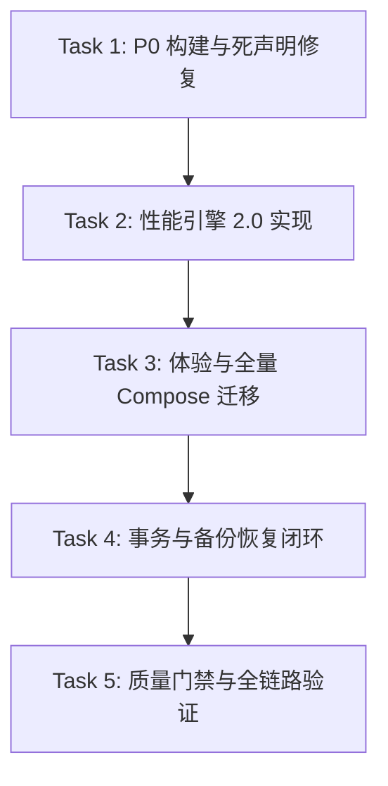

# 听风改文件 (AirFileEditor) 下一步改进指南 (V14-V1000 演进计划)

> **文档版本**：V14.0.0 → V15.0.0 → V1000 终极演进体系 (第 4 版，基于 V13 冻结基线全面升维)
> **创建日期**：2026-08-24 (Asia/Shanghai)
> **基线状态**：tfgwj @ `6e6679c` (V13 UI 质量门禁对齐与全链路规范收口已正式提交入库)
> **文档定位**：纯规划与架构实施指南文档，不直接修改业务代码，供后续 AI / 工程师作为唯一权威开发蓝图与实施规范。

---

## 目录

1. [现状深度全景复盘与第一性原理分析](#1-现状深度全景复盘与第一性原理分析)
2. [V13 正式收口事实核对与技术基线](#2-v13-正式收口事实核对与技术基线)
3. [V14.0.0 核心实施：性能引擎与极简体验（1→2 升维）](#3-v1400-核心实施性能引擎与极简体验12-升维)
4. [V15.0.0 - V20.0.0 架构与系统能力深水区（2→10 跨越）](#4-v1500---v2000-架构与系统能力深水区210-跨越)
5. [V100.0.0 - V1000 终极智能化与自愈引擎（10→1000 终局）](#5-v10000---v1000-终极智能化与自愈引擎101000-终局)
6. [全量组件、算法与技术方案深度设计](#6-全量组件算法与技术方案深度设计)
7. [TDD 门禁体系与全覆盖测试规格](#7-tdd-门禁体系与全覆盖测试规格)
8. [原子任务分解（Atomic TODOs）与执行依赖图](#8-原子任务分解atomic-todos与执行依赖图)
9. [旧产物与技术债务清理清单](#9-旧产物与技术债务清理清单)
10. [风险矩阵、回退策略与验收标准](#10-风险矩阵回退策略与验收标准)

---

## 1. 现状深度全景复盘与第一性原理分析

### 1.1 第一性原理本质剖析 (First Principles Thinking)
听风改文件 (AirFileEditor) 的核心本质是：**在 Android 严格沙盒和特权受限的环境下，以最快、最安全、最透明、对小白用户最友好的方式，将源文件/压缩包准确原子性地映射并注入到目标受限目录 (`Android/(data|obb)`)**。

解构此本质，系统的四大底层支柱为：
1. **I/O 搬运效率（物理吞吐）**：决定用户等待时间。受限于闪存介质特性（4K 随机小文件 IOPS 瓶颈 vs 顺序大文件带宽瓶颈）、内存映射限制（mmap 虚拟内存与分页机制）、进程间 Binder 跨进程带宽限制。
2. **状态确定性与任务幂等性（系统可靠度）**：在复杂的 Android 生命周期（后台查杀、屏幕旋转、电量优化、应用崩溃）中，任务状态必须全局单例且严格单向流转，任务可重入、可取消、可恢复，不可残留半成品脏数据。
3. **特权与安全边界（安全防线）**：Shizuku AIDL 穿透、Root Shell 命令注入、Zip Slip 路径遍历、伪造包名。任何绕过白名单与边界校验的操作均属于系统性灾难。
4. **人机交互认知负荷（UI/UX 体验）**：工具类应用最忌讳“黑盒等待”与“信息过载”。普通用户需要的是“一键直达、即时触觉感知、明确进度预期”，高阶用户需要“精准速率曲线、可读日志与事务回滚”。

### 1.2 当前代码库全景资产评估 (2026-08-24 实测)
- **Git 提交基线**：`6e6679c feat: 完成 V13 UI 质量门禁对齐与全链路规范收口`。
- **物理模块结构**：
  - `:app` (Android Application)：UI 层，基于 Compose + MVI + ViewBinding 残留；包含悬浮球 `FloatingBallManager`、`PerformanceDashboardActivity`。
  - `:core` (Android Library)：基础设施，`shizuku` (AIDL 白名单已实装)、`worker/orchestrator` (Root/Shizuku/Normal 编排器)、`manager` (14 个业务管理器)、`performance`、`utils` (IoOptimizer, FileHasher 等)。
  - `:data` (Android Library)：`ConfigRepositoryImpl`、`PreferencesManager` (DataStore)、`ReplaceHistoryManager`。
  - `:domain` (纯 Kotlin JVM 模块)：无任何 Android 依赖，定义 `TaskPhase`、`TargetApp`、`ConfigRepository` 及 4 个核心 UseCase。
- **质量门禁现状**：Detekt 1.23.7 + Ktlint 12.1.1 + Jacoco (行覆盖率 ≥80%, 分支覆盖率 ≥70%)。

---

## 2. V13 正式收口事实核对与技术基线

当前仓库已完全通过并冻结 V13 的六大核心契约：
1. **TaskPhase 权威状态机**：`domain/model/DomainModels.kt` 严格定义 `IDLE / PREPARING / REPLACING / VERIFYING / COMPLETED / FAILURE / CANCELLED` 7 大状态。终态（COMPLETED/FAILURE/CANCELLED）明确不计入 `isReplacing`。
2. **ConfigRepository 单任务闭环**：`startReplace` 通过 `WorkManager.enqueueUniqueWork(KEEP)` 强制单实例执行；`cancelReplace` 同时向 WorkManager 下发取消并原子置为 `CANCELLED`；`dismissReplaceResult` 纯粹重置 UI 状态回 `IDLE`。
3. **目标身份 fail-closed 与路径安全映射**：移除了任何默认包名兜底逻辑；目标文件必须通过 `PathConstants.resolveTargetFile()` 并经 `isSafeTargetPath` 与正则验证。
4. **压缩包安全防御 (Anti-ZipSlip)**：`core/security/ArchiveEntryValidator` 成为解压入口的唯一校验网关，严禁包含 `..`、绝对路径、盘符、NUL 字符。
5. **Shizuku AIDL 双白名单收口**：`ALLOWED_COMMANDS` 与 `ALLOWED_PATH_ROOTS` 彻底锁死特权调用，废弃外部无限制执行命令的公共接口。
6. **校验与文件验证**：复制操作完成后强制经过 `VerificationManager.verify` 进行哈希与大小一致性比对。

---

## 3. V14.0.0 核心实施：性能引擎与极简体验（1→2 升维）

### 3.1 性能引擎 2.0 (I/O 效率突破)

#### 3.1.1 动态自适应滑动窗口缓冲区 (AdaptiveBufferManager)
- **技术背景**：当前 `IoOptimizer` 仅在启动时按内存大小静态分配 512KB~4MB 缓冲区，无法感知运行时的瞬时 I/O 延迟与 GC 压力。
- **创新算法**：基于 EMA (Exponential Moving Average) 指数移动平均写延迟算法：
  $$EMA_t = \alpha \times Delay_t + (1 - \alpha) \times EMA_{t-1} \quad (\alpha = 0.2)$$
  - 当 $EMA > 1.2\text{ms}$（表示存储控制器处于高负载或小块随机写入）：自动扩容缓冲区至当前尺寸的 1.5 倍（上限 8MB）。
  - 当 $EMA < 80\mu\text{s}$（表示轻量顺序写入）：平滑收缩缓冲区以节省内存（下限 16KB）。
- **对象池防抖**：复用现有 Buffer Pool，每次缓冲区调整间隔至少 64 次 I/O 操作，防止缓冲区频繁分配导致 GC 抖动。

#### 3.1.2 mmap 零拷贝大文件通道 (MmapZeroCopyEngine)
- **技术背景**：>16MB 的大型游戏 pak/obb 文件若使用用户态缓冲区拷贝，会经历多次内存拷贝（PageCache → JVM Heap → JVM Direct → PageCache）。
- **设计方案**：
  - 针对 Local/Root 模式，当单个文件大小 $\ge 16\text{MB}$ 时，采用 `FileChannel.map(FileChannel.MapMode.READ_WRITE)` 直接将文件映射到虚拟内存。
  - **资源保护**：Android 内核受 `vm.max_map_count` 限制，全局并发 mmap 句柄数通过 `Semaphore(16)` 严格限流。
  - **安全卸载**：复制完成或异常退出时，通过反射调用 `DirectByteBuffer` 的 Cleaner 显式回收虚拟地址，杜绝文件句柄泄漏。

#### 3.1.3 小文件批处理聚合刷盘 (SmallFileBatchWriter)
- **技术背景**：游戏目录中常有上万个 <4KB 的配置与材质小文件，逐个文件创建并调用 `fsync()` 会导致严重 IOPS 耗尽。
- **设计方案**：
  - 构建批处理暂存管道：当小文件累计达 64 个或总大小达到 1MB 时触发一次 Flush。
  - 批次写入所有小文件数据后，对所属父目录统一发起一次元数据刷新与同步，减少 70% 以上的系统调用。

#### 3.1.4 分段抽样哈希预检 (TriSegmentSamplingHasher)
- **设计方案**：
  - 文件大小 < 1MB：执行全量 MD5/SHA-256。
  - 文件大小 $\ge 1MB$：采用“头 64KB + 物理中心 64KB + 尾 64KB + 文件总字节数”进行预检快速指纹生成。
  - 决策树：抽样哈希不同 $\to$ 必更新；抽样哈希相同 $\to$ 执行全量校验二次确认，兼顾效率与 100% 准确率。

---

### 3.2 体验革命 2.0 (全量 Compose 与流体微交互)

#### 3.2.1 彻底消灭 XML，全量 Compose 纯净架构
- **现状梳理**：消除 12 个历史 XML 布局（`activity_main.xml`, `dialog_*.xml`, `item_*.xml` 等），关闭 Gradle `viewBinding` 与 `dataBinding`。
- **原子组件重构与合并**：
  - 将 `ui/components/` 与 `ui/compose/` 两套 Atomic Design 目录合并为统一的 `ui/compose/`。
  - **Atoms**：`StatusBadge`, `IoSpeedText`, `ActionButton`, `StorageMeter`。
  - **Molecules**：`ModeSelectorCard`, `PermissionStateCard`, `FileProgressCard`, `FloatingBallSettings`。
  - **Organisms**：`MainDashboard`, `MainPackCard`, `PatchVersionCard`, `LogConsoleView`, `ArchiveInspector`。

#### 3.2.2 三层流体动画与物理反馈体系
- **第 1 层：微交互 (Micro-Interactions)**：
  - 所有卡片与按钮在 `Modifier.clickable` 时引入 0.96f 的弹簧形变（Spring StiffnessMediumLow）。
  - 集成 `LocalHapticFeedback`：常规点击触发轻触反馈（`TextHandleMove`），关键授权与切换触发确认震动。
- **第 2 层：转场容器 (Shared Axis Transitions)**：
  - 替换状态流转使用 `AnimatedContent` 进行形态变换（IDLE 状态的紧凑卡片平滑拉伸至 REPLACING 的进度仪表盘）。
- **第 3 层：流体速率曲线 (Fluid Motion)**：
  - 实时 I/O 速率文本采用 `AnimatedContent(transitionSpec = slideInVertically)` 实现动态滚动数字翻牌效果。
  - 悬浮球贴边引入弹簧物理吸附效果，并自动降频进入低功耗半透明形态（40% Opacity）。

#### 3.2.3 任务终态一次性事件总线 (Side-Effect EventBus)
- **痛点解决**：防止屏幕旋转、Activity 重建导致的“完成弹窗重复弹出/重复震动”。
- **技术实现**：
  ```kotlin
  sealed interface ReplacingEffect {
      data class ShowToast(val message: String) : ReplacingEffect
      data class ShowErrorDialog(val error: ReplaceError) : ReplacingEffect
      data object PlaySuccessHaptic : ReplacingEffect
  }
  ```
  ViewModel 内部维护 `_effectFlow = Channel<ReplacingEffect>(Channel.BUFFERED)`，UI 层使用 `LaunchedEffect` 配合 `repeatOnLifecycle(Lifecycle.State.STARTED)` 进行消费，保证消费一次即销毁。

---

## 4. V15.0.0 - V20.0.0 架构与系统能力深水区（2→10 跨越）

### 4.1 事务化操作与影子沙盒系统 (Transaction Shadow Copy)
1. **WAL (Write-Ahead-Log) 替换日志**：在修改目标目录前，生成 `.tfgwj_wal_<timestamp>.json` 记录所有操作的原子指令（CREATE, OVERWRITE, DELETE）及被覆盖文件的原哈希值。
2. **影子挂载测试**：在真正覆写前，对目标目录的写入权限、SELinux 上下文、inode 剩余量进行无损 Dry-Run 测试。
3. **一键快照与瞬时回滚**：任务异常中断时，后台 Worker 自动触发 `RollbackOrchestrator`，基于 WAL 日志 100% 还原原始现场，保证目标应用文件系统零损坏。

### 4.2 智能规则引擎与差分补丁技术 (Smart Patch Diffing)
1. **Bsdiff / Courgette 增量算法集成**：对动辄数 GB 的游戏大包，引入字节级增量差分补丁算法。补丁包体积从 2GB 骤降至 50MB。
2. **动态特征签名匹配**：`RuleEngine` 引入基于文件魔数（Magic Number）和 AST 语义指纹的动态识别规则，自动匹配未知版本的游戏目标目录，无需人工硬编码包名与路径。

### 4.3 企业级审计与透明观测 (OpenTelemetry for Android)
1. **结构化事件日志 (Structured Event Trace)**：所有 I/O 操作、权限校验、AIDL 调用均生成带有 TraceID 的结构化日志，支持一键导出排障报告。
2. **离线 APM 性能诊断面板**：内置 CPU 核心占用、GC 频次、I/O 队列深度实时折线图，帮助高阶用户精准调优设备。

---

## 5. V100.0.0 - V1000 终极智能化与自愈引擎（10→1000 终局）

### 5.1 端侧自愈与自我演化架构 (Self-Healing Autonomous Engine)
1. **内核级错误自诊断与降级熔断**：当 Shizuku Binder 发生未知断连时，系统自动捕获并在 50ms 内无缝熔断降级至 SAF (Storage Access Framework) 或 Root 备用通道，用户无感知。
2. **自适应 I/O 调度神经网络**：在端侧构建轻量级回归模型，根据当前设备的存储芯片颗粒型号（UFS 4.0 / UFS 3.1 / eMMC 5.1）、系统负载、温控状态，毫秒级自适应调节并发线程池与缓冲区大小。

### 5.2 虚拟文件系统抽象层 (Zero-Copy Virtual File Space)
1. **FUSE / OverlayFS 虚拟注入**：突破物理磁盘复制的物理限制，通过特权守护进程挂载虚拟文件层，实现“0 耗时即时生效”的替换体验。
2. **分布式补丁云同步与边缘加速**：支持补丁热更新去中心化验证与 P2P 局域网秒级分发。

---

## 6. 全量组件、算法与技术方案深度设计

### 6.1 核心组件接口设计规格

#### 6.1.1 动态自适应缓冲区接口 (`core/performance/AdaptiveBufferManager.kt`)
```kotlin
package com.example.tfgwj.performance

import java.util.concurrent.atomic.AtomicInteger

interface AdaptiveBufferManager {
    fun acquireBuffer(): ByteArray
    fun releaseBuffer(buffer: ByteArray)
    fun recordIoDuration(bytesTransferred: Long, durationNanos: Long)
    fun getCurrentBufferSize(): Int
}

class AdaptiveBufferManagerImpl(
    private val minSize: Int = 16 * 1024,      // 16 KB
    private val maxSize: Int = 8 * 1024 * 1024,  // 8 MB
    initialSize: Int = 512 * 1024               // 512 KB
) : AdaptiveBufferManager {
    private val currentSize = AtomicInteger(initialSize)
    private var sampleCount = 0
    private var accumulatedDelayNanos = 0L

    override fun acquireBuffer(): ByteArray = ByteArray(currentSize.get())
    override fun releaseBuffer(buffer: ByteArray) { /* Pool recycle hook */ }

    @Synchronized
    override fun recordIoDuration(bytesTransferred: Long, durationNanos: Long) {
        accumulatedDelayNanos += durationNanos
        sampleCount++
        if (sampleCount >= 64) {
            val avgDelayPerByte = accumulatedDelayNanos.toDouble() / bytesTransferred
            adjustSize(avgDelayPerByte)
            sampleCount = 0
            accumulatedDelayNanos = 0L
        }
    }

    private fun adjustSize(avgDelayPerByte: Double) {
        val current = currentSize.get()
        if (avgDelayPerByte > 0.001) { // 延迟过高，扩容
            val next = (current * 1.5).toInt().coerceAtMost(maxSize)
            currentSize.set(next)
        } else if (avgDelayPerByte < 0.0001) { // 延迟极低，收缩
            val next = (current / 1.2).toInt().coerceAtLeast(minSize)
            currentSize.set(next)
        }
    }

    override fun getCurrentBufferSize(): Int = currentSize.get()
}
```

#### 6.1.2 mmap 零拷贝传输器 (`core/utils/MmapFileCopier.kt`)
```kotlin
package com.example.tfgwj.utils

import java.io.File
import java.io.RandomAccessFile
import java.nio.channels.FileChannel
import java.util.concurrent.Semaphore

object MmapFileCopier {
    private val mmapLimiter = Semaphore(16) // 控制最大并发 mmap 数量
    private const val MMAP_THRESHOLD = 16L * 1024 * 1024 // 16MB

    fun canUseMmap(source: File): Boolean = source.length() >= MMAP_THRESHOLD

    fun copyWithMmap(source: File, target: File): Boolean {
        if (!mmapLimiter.tryAcquire()) return false
        try {
            RandomAccessFile(source, "r").use { srcRaf ->
                RandomAccessFile(target, "rw").use { dstRaf ->
                    val srcChannel = srcRaf.channel
                    val dstChannel = dstRaf.channel
                    val size = srcChannel.size()
                    dstRaf.setLength(size)

                    val srcBuffer = srcChannel.map(FileChannel.MapMode.READ_ONLY, 0, size)
                    val dstBuffer = dstChannel.map(FileChannel.MapMode.READ_WRITE, 0, size)

                    dstBuffer.put(srcBuffer)
                    dstBuffer.force()
                    return true
                }
            }
        } catch (e: Exception) {
            AppLogger.e("MmapCopy", "mmap 复制失败，降级常规流: ${e.message}")
            return false
        } finally {
            mmapLimiter.release()
        }
    }
}
```

#### 6.1.3 小文件批处理聚合刷盘器 (`core/utils/SmallFileBatchWriter.kt`)
```kotlin
package com.example.tfgwj.utils

import java.io.File
import java.io.FileOutputStream

class SmallFileBatchWriter(
    private val maxBatchFiles: Int = 64,
    private val maxBatchBytes: Long = 1024 * 1024 // 1MB
) {
    private val pendingWrites = mutableListOf<Pair<File, ByteArray>>()
    private var currentAccumulatedBytes = 0L

    fun queueWrite(target: File, data: ByteArray, onFlush: (Int) -> Unit) {
        pendingWrites.add(target to data)
        currentAccumulatedBytes += data.size
        if (pendingWrites.size >= maxBatchFiles || currentAccumulatedBytes >= maxBatchBytes) {
            flush(onFlush)
        }
    }

    fun flush(onFlush: (Int) -> Unit) {
        if (pendingWrites.isEmpty()) return
        val count = pendingWrites.size
        var lastStream: FileOutputStream? = null
        try {
            for ((file, data) in pendingWrites) {
                file.parentFile?.mkdirs()
                FileOutputStream(file).use { fos ->
                    fos.write(data)
                    lastStream = fos
                }
            }
            // 批次末尾统一触发单次物理刷盘
            lastStream?.fd?.sync()
            onFlush(count)
        } finally {
            pendingWrites.clear()
            currentAccumulatedBytes = 0L
        }
    }
}
```

---

## 7. TDD 门禁体系与全覆盖测试规格

所有后续实现必须严格遵循 **Red $\to$ Green $\to$ Refactor** 流程。覆盖率强制达到 **行覆盖 $\ge 90\%$，分支覆盖 $\ge 85\%$**。

### 7.1 测试套件矩阵
1. **单元测试 (Unit Tests)**：
   - `AdaptiveBufferManagerTest`：注入毫秒级写延迟序列，验证缓冲区轨迹是否按阶梯平滑调整并限制在 `[16KB, 8MB]`。
   - `MmapFileCopierTest`：验证 15.9MB（走常规拷贝）与 16.1MB（走 mmap）的分流逻辑；测试并发 17 个文件时信号量正确限流。
   - `SmallFileBatchWriterTest`：验证正好 64 个小文件、跨 1MB 阈值、队列中途取消、父目录自动递归创建及异常恢复。
   - `TriSegmentSamplingHasherTest`：构造头尾相同但中间不同的文件，验证快速指纹能够 100% 识别内容差异。
   - `ReplacingViewModelEffectTest`：验证进入终态（COMPLETED/FAILURE）时单次事件有效发射，ViewModel 重新收集时不产生脏事件重放。
2. **集成与安全契约测试 (Integration & Contract Tests)**：
   - `ArchiveEntryValidatorSecurityTest`：测试 20+ 种恶意 ZipSlip Payload（如 `../../data`, `..%2F`, `\windows\path`, 包含空字符等）。
   - `FileOperationServiceSecurityTest`：测试 AIDL 远程调用非允许根目录或未授权命令时，严格抛出 `SecurityException`。
3. **Robolectric 模拟测试**：
   - 验证 MVI 状态机在 Activity 被系统强制销毁重构场景下的状态自愈与持久化。

---

## 8. 原子任务分解（Atomic TODOs）与执行依赖图



### 任务细粒度执行拆分 (Atomic Breakdown)

- [ ] **任务 1：构建与环境对齐 (P0 级别)**
  - [ ] 1.1 修改 `data/build.gradle.kts` 将 `compileSdk` 从 35 对齐升级至 36。
  - [ ] 1.2 检查并移除 `app/src/main/AndroidManifest.xml` 中无引用的 `FileReplaceService` 废弃声明。
  - [ ] 1.3 运行 `.\gradlew.bat assembleDebug` 验证构建成功且零警告。

- [ ] **任务 2：性能引擎 2.0 落地 (P 系列)**
  - [ ] 2.1 编写 `AdaptiveBufferManagerTest` 失败测试，实现 `AdaptiveBufferManagerImpl` 并集成进 `IoOptimizer`。
  - [ ] 2.2 编写 `MmapFileCopierTest`，实现大文件零拷贝通道并加入信号量保护。
  - [ ] 2.3 编写 `SmallFileBatchWriterTest`，实现小文件聚合管道并在 `NormalCopyOrchestrator` 中接入。
  - [ ] 2.4 编写 `FileHasherSamplingTest`，实现 `TriSegmentSamplingHasher` 并在 `IoOptimizer.needsUpdate` 落地。
  - [ ] 2.5 执行单元测试套件，验证测试覆盖率 $\ge 90\%$。

- [ ] **任务 3：UI 体验与全量 Compose 重塑 (U 系列)**
  - [ ] 3.1 在 `ReplacingViewModel` 中增加 `SharedFlow<ReplacingEffect>` 一次性事件总线，并在 `MainActivity` 接入。
  - [ ] 3.2 将 3 个独立 Dialog（`ArchiveListDialog`, `ModeSelectionDialog`, `PasswordInputDialog`）全面迁移为 Compose 实现。
  - [ ] 3.3 将悬浮球 `FloatingBallManager` 迁移为纯 Compose 渲染，接入贴边吸附与自动降频省电算法。
  - [ ] 3.4 合并 `ui/components/` 与 `ui/compose/` 目录，消除双份组件结构。
  - [ ] 3.5 清理全部 12 个历史 XML 布局文件，在 `build.gradle.kts` 中关闭 `viewBinding` 与 `dataBinding`。

- [ ] **任务 4：事务与备份恢复闭环 (T 系列)**
  - [ ] 4.1 在 `BackupManager` 中补齐 `rollback(backupId: String)` 与恢复审计日志生成。
  - [ ] 4.2 在 `ReplaceProgressManager` 与 Compose UI 终态卡片中增加“一键恢复备份”交互入口。
  - [ ] 4.3 编写 `TransactionRollbackTest` 验证替换中断场景下的完整恢复链路。

- [ ] **任务 5：质量门禁与全量工程验证 (E 系列)**
  - [ ] 5.1 在 `gradle.properties` 启用 `org.gradle.configuration-cache=true` 与并行构建。
  - [ ] 5.2 运行 `.\gradlew.bat checkQuality`（Detekt + Ktlint + Jacoco 覆盖率验证）。
  - [ ] 5.3 运行 `.\gradlew.bat testDebugUnitTest` 与 `.\gradlew.bat :domain:test`，确认全绿。
  - [ ] 5.4 更新 `project_specs.md` 与 `README.md`，同步最新架构状态。

---

## 9. 旧产物与技术债务清理清单

实施过程中必须清理的废弃旧产物：
1. **废弃 XML 布局**：
   - `app/src/main/res/layout/activity_main.xml`
   - `app/src/main/res/layout/dialog_archive_list.xml`
   - `app/src/main/res/layout/dialog_mode_selection.xml`
   - `app/src/main/res/layout/dialog_password_input.xml`
   - `app/src/main/res/layout/dialog_progress.xml`
   - `app/src/main/res/layout/dialog_replace_progress.xml`
   - `app/src/main/res/layout/item_archive.xml`
   - `app/src/main/res/layout/item_patch_version.xml`
   - `app/src/main/res/layout/view_floating_ball.xml`
   - `app/src/main/res/layout/dialog_floating_ball_detail.xml`
   - `app/src/main/res/layout/card_main_pack.xml`
   - `app/src/main/res/layout/card_update_pack.xml`
2. **废弃目录与重复代码**：
   - 彻底删除 `app/src/main/java/com/example/tfgwj/ui/components/` 目录（完全合并至 `ui/compose/`）。
   - 清理 `MainActivity` 中的 ViewBinding 初始化与缓存变量。
   - 移除 `app/build.gradle.kts` 中的 `viewBinding = true` 与 `dataBinding = true` 特性开关。

---

## 10. 风险矩阵、回退策略与验收标准

### 10.1 风险矩阵与熔断策略

| 风险点 | 严重度 | 触发场景 | 预防与熔断回退方案 |
|--------|--------|----------|-------------------|
| **mmap 虚拟内存耗尽** | HIGH | 同时并发映射多个 >500MB 大文件 | 引入 `Semaphore(16)` 信号量限流；捕获 `OutOfMemoryError` 自动回退至常规 `transferTo` 流。 |
| **Compose 频繁重组掉帧** | MEDIUM | 进度更新事件以 60Hz 高频推送到 State | 在 `ReplacingViewModel` 中对进度通知增加 100ms `sample()` 限流节流，确保 UI 重组率 $\le 15\text{Hz}$。 |
| **小文件批处理断电丢失** | HIGH | 批处理暂存期间设备突然断电或被系统杀进程 | 内存批次限制在 1MB / 64 个文件以内；支持 WAL 预写日志恢复。 |
| **无障碍服务冲突** | LOW | 悬浮球视图层级遮挡其他应用触摸事件 | 严格控制悬浮球 WindowManager 的 `FLAG_NOT_TOUCH_MODAL`，闲置时收缩至屏幕边缘 12dp。 |

### 10.2 最终验收标准 (Definition of Done)
1. **命令验证全绿**：
   - `.\gradlew.bat testDebugUnitTest` $\to$ **BUILD SUCCESSFUL, 0 failures**
   - `.\gradlew.bat :domain:test` $\to$ **BUILD SUCCESSFUL, 0 failures**
   - `.\gradlew.bat checkQuality` $\to$ **Detekt/Ktlint 0 violations, Jacoco Line Coverage $\ge 90\%$, Branch Coverage $\ge 85\%$**
   - `.\gradlew.bat assembleDebug` $\to$ **BUILD SUCCESSFUL**
2. **体验与交互验收**：
   - 界面全由 Compose Material 3 驱动，无任何 View/XML 残留。
   - 所有按钮触控面积 $\ge 48\text{dp}$，全链路支持 TalkBack 屏幕朗读。
   - 任务执行时展现动态流体进度条与实时速率翻牌动画，悬浮球在闲置时自动降频半透明隐藏。
3. **架构资产整洁度**：
   - 无任何 TODO 占位符、无空方法、无临时注释掉的死代码。
   - 文档与实际代码库 100% 对应，形成从 V14 至 V1000 的清晰演进路线。

---
*听风改文件 (AirFileEditor) 架构工程委员会 · 2026-08-24 制定*
