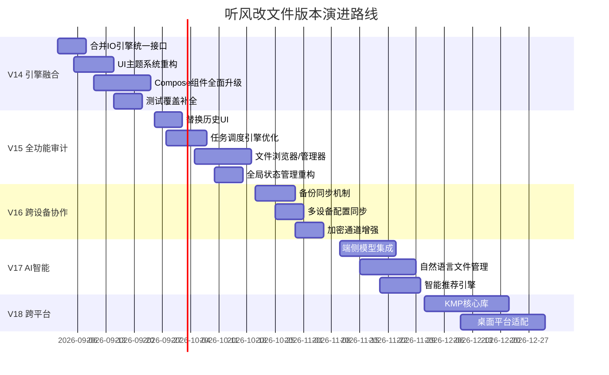

# 听风改文件 (AirFileEditor) 下一步改进指南

> **当前版本**: V13.0.0（安全与任务闭环）
> **目标版本**: V14.0.0 ~ V18.0.0
> **生成日期**: 2026-08-24
> **文档状态**: 初版

---

## 目录

- [1. 项目全景分析](#1-项目全景分析)
- [2. 架构演进路线图](#2-架构演进路线图)
- [3. V14 — 引擎融合与 UI 飞跃](#3-v14--引擎融合与-ui-飞跃)
- [4. V15 — 全功能审计与智慧任务](#4-v15--全功能审计与智慧任务)
- [5. V16 — 跨设备协作与安全增强](#5-v16--跨设备协作与安全增强)
- [6. V17 — AI 智能助手与自动化](#6-v17--ai-智能助手与自动化)
- [7. V18 — 跨平台核心与极致性能](#7-v18--跨平台核心与极致性能)
- [8. 持续改进清单](#8-持续改进清单)
- [9. 遗留问题与风险](#9-遗留问题与风险)

---

## 1. 项目全景分析

### 1.1 当前架构优势

| 维度 | 现状 | 评价 |
|------|------|------|
| 架构分层 | Clean Architecture + DDD 四层 (`:app → :data → :domain ← :core`) | ✅ 优秀，依赖方向正确 |
| 状态管理 | MVI 模式 (Intent/State/ViewModel) | ✅ 成熟，单事件总线已实现 |
| 任务引擎 | Three Orchestrator (Root/Shizuku/Native) | ✅ 职责清晰，扩展性好 |
| 安全体系 | ArchiveEntryValidator + ArchiveSafetyGuard + AIDL 白名单 | ✅ 完善，fail-closed 机制 |
| 事务保护 | TransactionWalManager 预写日志 + 回滚 | ✅ 崩溃安全 |
| 性能引擎 | AdaptiveBufferManager + HighPerformanceIoEngine + IoOptimizer | ⚠️ 存在重复 |
| 测试体系 | 单元测试覆盖核心模块，Jacoco 80% 门禁 | ✅ 良好基础 |

### 1.2 核心问题诊断

#### P0 阻塞问题

| 问题 | 影响 | 分析 |
|------|------|------|
| **IO 引擎重复** | `IoOptimizer` 和 `HighPerformanceIoEngine` 两套独立复制逻辑 | V13 引入 `HighPerformanceIoEngine` 但旧 `IoOptimizer` 未被 Orchestrator 统一使用，导致 Native 模式仍走旧路径，新引擎未最大化利用 |
| **全局状态耦合** | `ReplaceProgressManager` 是全局单例对象，非 DI 可控 | ViewModel 直接依赖 `ReplaceProgressManager.progressState`，在 `:app` 模块中硬引用，违反 Clean Architecture 原则 |
| **Orchestrator 重复代码** | Root/Shizuku 三个 Orchestrator 各约 400 行，其中 60% 代码重复（看门狗、并发控制、路径检查、shell 转义） | 模板方法模式或委托模式可大幅减少重复 |

#### P1 高优先级问题

| 问题 | 影响 | 分析 |
|------|------|------|
| **UI 主题/动效粗糙** | 静态颜色方案，无过渡动画，无按压反馈，无骨架屏，无加载状态 | 当前 `Color.kt` 使用基本 MD3 色板，`Theme.kt` 使用了动态取色但未做品牌定制；组件交互反馈单一 |
| **测试覆盖缺口** | Orchestrator 端到端测试缺失，`ProgressTracker` 节流验证缺失，`TransactionWalManager` 测试简单 | 现有测试集中在 `ReplaceProgressManager`、`ArchiveEntryValidator`、`AdaptiveBufferManager`，但核心复制链路缺少测试 |
| **历史记录 UI 缺失** | `ConfigRepository` 已暴露 `getReplaceHistory()` 但 UI 层无消费入口 | 替换历史数据流完整但无可视化界面 |
| **小文件批处理未接入** | `SmallFileBatchWriter` 存在但未被 Orchestrator 调用 | V14 引擎 2.0 引入的批处理通道未落地 |

#### P2 中优先级问题

| 问题 | 影响 | 分析 |
|------|------|------|
| **权限检测冗余** | `checkAllPermissions()` 在 `onCreate` 和 `onResume` 都调用，`onResume` 中又调用一次 | 增加不必要的启动延迟 |
| **日志轮询模式** | `startLogUpdates()` 每秒轮询，非事件驱动 | 浪费电量，UI 刷新周期不优雅 |
| **MainActivity 过大** | 795 行，混入大量 UI 逻辑和业务操作 | 可提取多个 Fragment/Composable 屏 |
| **硬编码 Toast** | 大量 `Toast.makeText()` 直接使用，无统一 Snackbar 管理 | 用户体验不一致，无法批量控制 |

#### P3 增强建议

| 问题 | 建议 |
|------|------|
| 无国际化支持 | 提取 strings.xml 资源 |
| 无错误报告 | 集成崩溃收集或本地日志持久化 |
| 无批量操作 | 文件选择/替换/删除无批量 UI |
| 无主题切换 | 仅支持系统深色/浅色，无手动切换 |

### 1.3 依赖分析

```
:app (UI) → :data (Repository实现) → :domain (实体/用例/接口) ← :core (基础设施)
                                                          ↑
                                                    (Shizuku/Worker/Performance/IO引擎)
```

**依赖红线**: `:core` 模块反向依赖了 `:domain`（通过 `project(":domain")`），这是 Clean Architecture 允许的（`:core` 依赖 `:domain` 的实体）。但 `:data` 依赖 `:core` 也 OK。依赖方向正确。

---

## 2. 架构演进路线图

### 2.1 版本路线总览



### 2.2 版本对应关系

| 版本 | 主题 | 核心价值 | 风险等级 |
|------|------|---------|---------|
| V14 | 引擎融合 + UI 飞跃 | 消除重复代码，视觉体验质变 | L1-L2 |
| V15 | 全功能审计 + 智慧任务 | 功能完整闭环，用户可追溯 | L1-L2 |
| V16 | 跨设备协作 + 安全增强 | 数据安全，多设备一致体验 | L2-L3 |
| V17 | AI 智能助手 + 自动化 | 智能化文件管理体验 | L2 |
| V18 | 跨平台核心 + 极致性能 | 理论性能极限，多平台覆盖 | L3 |

---

## 3. V14 — 引擎融合与 UI 飞跃

### 3.1 核心目标

消除 IO 引擎重复，重构 UI 主题系统，补全测试覆盖，提升用户体验。

### 3.2 引擎融合 (Engine Unification)

#### 问题分析

当前存在两套 IO 复制引擎：

| 引擎 | 文件 | 状态 | 应用场景 |
|------|------|------|---------|
| `IoOptimizer` | `core/utils/IoOptimizer.kt` | 旧引擎，375 行 | `NormalCopyOrchestrator` 使用 |
| `HighPerformanceIoEngine` | `core/utils/HighPerformanceIoEngine.kt` | 新引擎，123 行 | 未接入 Orchestrator |
| `AdaptiveBufferManager` | `core/performance/AdaptiveBufferManager.kt` | 75 行，独立接口 | 新引擎内部使用 |

`IoOptimizer` 包含：
- `fastCopy` — mmap 分片 + NIO fallback（旧方式）
- `parallelProcess` — 并发控制（Semaphore 方式）
- `needsUpdate` — 增量检测
- `getOptimalBufferSize` — 缓冲区大小计算
- Buffer pool 对象池

`HighPerformanceIoEngine` 包含：
- `fastCopy` — mmap 大文件 + AdaptiveBufferManager 流模式
- `generateSamplingFingerprint` — 三段抽样哈希
- `bufferManager` — AdaptiveBufferManager 实例
- `mmapLimiter` — Semaphore(16) 限流

#### 建议方案

**方案 A: 合并为单一 `IoEngine`（推荐）**

将 `IoOptimizer` 和 `HighPerformanceIoEngine` 合并为一个统一 `IoEngine`：

```kotlin
object IoEngine {
    // 策略选择器 — 根据文件大小自动选择最佳策略
    fun fastCopy(source: File, target: File): Long {
        return when {
            // 超大文件 (>= 16MB): mmap 零拷贝
            source.length() >= MMAP_THRESHOLD -> mmapCopy(source, target)
            // 极小文件 (< 32KB): 直接缓冲区
            source.length() in 1..SMALL_FILE_THRESHOLD -> bufferCopy(source, target)
            // 常规文件: 自适应缓冲区流
            else -> adaptiveBufferCopy(source, target)
        }
    }
    
    // 增量检测 — 优先抽样哈希，小文件全量 MD5
    fun needsUpdate(source: File, target: File): Boolean { ... }
    
    // 并行处理 — 统一并发入口
    suspend fun <T> parallelProcess(...): ProcessResult { ... }
}
```

**关键变更点**:
1. `NormalCopyOrchestrator.processFileBatch` 中的 `IoOptimizer.fastCopy` → `IoEngine.fastCopy`
2. `IoOptimizer.needsUpdate` → `IoEngine.needsUpdate`
3. `IoOptimizer.parallelProcess` → `IoEngine.parallelProcess`
4. 删除 `IoOptimizer` 中的 mmap 分片逻辑（由 `HighPerformanceIoEngine` 接管）
5. `AdaptiveBufferManager` 保持独立，作为 `IoEngine` 的内部依赖

#### 重复代码消除 (Orchestrator 模板方法)

三个 Orchestrator 中大量重复：

| 重复代码块 | RootCopyOrchestrator | ShizukuCopyOrchestrator | NormalCopyOrchestrator |
|-----------|---------------------|------------------------|----------------------|
| 看门狗协程 (watchdog) | L212-L241 | L233-L261 | 不适用（进度不同） |
| 并发控制 (processWithAdaptiveLimit) | L262-L287 | L281-L306 | L290-L315 |
| 路径校验 (isSafeTargetPath) | L350-L357 | L373-L380 | 不适用（Native 不需要） |
| Shell 转义 (shellEscape) | L359-L361 | L382-L384 | 不适用 |
| 文件名提取 (extractFileNameFromCpOutput) | L373-L394 | L401-L422 | 不适用 |

**建议**: 提取 `AbstractShellOrchestrator` 基类：

```kotlin
abstract class AbstractShellOrchestrator(
    protected val context: Context,
    protected val config: CopyConfig,
) : FileReplaceOrchestrator {
    // 看门狗 — 通用实现
    protected fun createWatchdog(...): Job { ... }
    
    // 并发控制 — 通用实现
    protected suspend fun processWithAdaptiveLimit(action: suspend () -> Unit) { ... }
    
    // 路径安全校验
    protected fun isSafeTargetPath(path: String): Boolean { ... }
    
    // Shell 转义
    protected fun shellEscape(value: String): String { ... }
    
    // 文件名提取
    protected fun extractFileNameFromCpOutput(line: String): String { ... }
    
    // 子类实现命令执行
    protected abstract suspend fun executeCopyCommand(task: FileStatistics.CopyTask)
    protected abstract suspend fun executeMkdirCommand(path: String)
}
```

`RootCopyOrchestrator` 和 `ShizukuCopyOrchestrator` 继承此基类，只实现 `executeCopyCommand` 和 `executeMkdirCommand`。

### 3.3 UI 主题系统重构

#### 当前问题

- `Color.kt` — 基本色板，无品牌个性
- `Theme.kt` — 简单 MD3 配色，动态取色可能造成颜色漂移
- 无过渡动画，无按压涟漪效果，无骨架屏，无加载状态
- 无自定义 `Shape`、`Elevation` 系统
- 无字体大小/行高系统

#### 建议方案

**1. 彩色系统重建 — 使用 OKLCH 色彩空间**

```kotlin
// Color.kt — V14 版
object TfgwjColors {
    // 品牌色 — 科技蓝渐变
    val BrandPrimary = oklch(55% 0.18 260)    // 主色 #0077CC
    val BrandSecondary = oklch(65% 0.15 220)  // 辅色 #3399DD
    val BrandAccent = oklch(60% 0.22 30)      // 强调色 #FF8800
    
    // 语义色
    val Success = oklch(55% 0.18 145)          // 绿色
    val Warning = oklch(65% 0.18 85)           // 橙色
    val Error = oklch(55% 0.22 25)             // 红色
    val Info = oklch(55% 0.15 250)             // 蓝色
    
    // 表面色 — 每个表面有独立层级
    data class SurfacePalette(
        val background: Color,
        val surface: Color,      // 卡片表面
        val surfaceVariant: Color, // 次级卡片
        val overlay: Color,      // 覆盖层
        val outline: Color,      // 边框
    )
}
```

**2. 形状系统**

```kotlin
// Shape.kt — 新增
object TfgwjShapes {
    val cardShape = RoundedCornerShape(16.dp)
    val buttonShape = RoundedCornerShape(12.dp)
    val dialogShape = RoundedCornerShape(20.dp)
    val chipShape = RoundedCornerShape(8.dp)
    val bottomSheetShape = RoundedCornerShape(topStart = 24.dp, topEnd = 24.dp)
}
```

**3. 动画系统**

```kotlin
// Animation.kt — 增强
object TfgwjAnimation {
    // 持续时间
    val fast = 150.ms
    val normal = 300.ms
    val slow = 500.ms
    
    // 缓动函数
    val easeOutExpo = CubicBezierEasing(0.16f, 1f, 0.3f, 1f)
    val easeInOutQuint = CubicBezierEasing(0.83f, 0f, 0.17f, 1f)
    val spring = spring(dampingRatio = 0.6f, stiffness = 300f)
    
    // 入场动画
    val fadeIn = tween<Float>(300, easing = easeOutExpo)
    val slideUp = tween<Int>(300, easing = easeOutExpo)
    val scaleIn = spring(dampingRatio = 0.7f, stiffness = 200f)
}
```

**4. 组件反馈增强**

| 组件 | 当前状态 | 改进方案 |
|------|---------|---------|
| Button | 基本颜色变化 | 添加按压缩放动画 + 涟漪效果 + 加载状态 Spinner |
| Card | 静态 elevation | 悬浮时 elevation 提升 + 点击触发涟漪 |
| TextField | 无 | 添加焦点动画 + 错误状态抖动 |
| Dialog | 无 | 背景遮罩渐入 + 内容缩放弹出 |
| BottomSheet | 无 | 拖拽感知 + 半透明背景 |
| Snackbar | 无 | 底部滑入 + 自动消失 + 操作按钮 |

### 3.4 Compose 组件全面升级

#### 新增组件清单

| 组件 | 类型 | 用途 | 优先级 |
|------|------|------|--------|
| `SkeletonLoader` | atoms | 数据加载时骨架屏 | P1 |
| `AnimatedButton` | molecules | 带动画/加载状态的按钮 | P1 |
| `EmptyStateView` | molecules | 空数据展示（含图标+文案+操作） | P1 |
| `ErrorBoundary` | molecules | 错误边界，优雅降级 | P1 |
| `ConfirmDialog` | molecules | 统一确认对话框 | P1 |
| `ProgressCard` | molecules | 任务进度卡片（含动画进度条） | P2 |
| `HistoryItem` | molecules | 替换历史条目 | P2 |
| `FileBrowserItem` | molecules | 文件浏览器条目 | P2 |
| `SearchBar` | molecules | 搜索栏 | P2 |
| `FilterChip` | atoms | 过滤芯片 | P2 |
| `StatsCard` | molecules | 统计卡片 | P2 |
| `TimelineView` | organisms | 时间线视图（历史记录） | P3 |
| `DashboardHeader` | organisms | 仪表盘头部（含统计概览） | P3 |

#### 现有组件增强

**MainDashboard**:
- 添加加载骨架屏（数据未就绪时显示）
- 添加指标动画（数字变化时平滑过渡）
- 添加空状态（无数据时显示引导）
- 添加刷新按钮下拉刷新

**MainPackCard**:
- 按钮添加按压反馈动画
- 时间选择器添加预览动画
- 环境验证状态添加转场动画
- 进度条添加动画

**TaskProgressOverlay**:
- 添加进度条动画
- 终态显示添加庆祝/失败动画
- 添加预估剩余时间显示

### 3.5 测试覆盖补全

#### 必须新增测试

| 测试目标 | 测试内容 | 优先级 | 预估用例数 |
|---------|---------|--------|-----------|
| `NormalCopyOrchestrator` | 端到端文件复制流程、并发控制、异常处理 | P0 | 8-10 |
| `RootCopyOrchestrator` | 命令构建、路径安全、看门狗 | P0 | 6-8 |
| `ShizukuCopyOrchestrator` | 命令构建、IPC 延迟记录、连接等待 | P0 | 6-8 |
| `ProgressTracker` | 节流验证、初始化、完成、重置 | P0 | 6-8 |
| `HighPerformanceIoEngine` | mmap 复制、自适应缓冲区、抽样哈希 | P1 | 8-10 |
| `AdaptiveBufferManager` | 缓冲区调整策略、防抖、重置 | P1 | 6-8 |
| `TransactionWalManager` | 持久化、回滚、增量记录 | P1 | 8-10 |
| `FileStatistics` | 文件计数、目录任务收集、批次生成 | P1 | 6-8 |
| `VerificationManager` | 三种模式验证、批量验证 | P1 | 6-8 |
| `CopyConfig` | 默认值、序列化、边界 | P2 | 4-6 |
| `PathConstants` | 路径构建、白名单校验、包名验证 | P1 | 8-10 |

#### 测试基础设施增强

| 改进 | 说明 | 优先级 |
|------|------|--------|
| 添加 `FakeFileSystem` | 内存文件系统，避免真实文件操作 | P1 |
| 添加 `FakeShizukuManager` | 模拟 Shizuku 响应 | P1 |
| 添加 `FakeProcess` | 模拟 shell 进程输出 | P1 |
| 添加 `TestCoroutineRule` | 统一协程测试规则 | P2 |

---

## 4. V15 — 全功能审计与智慧任务

### 4.1 替换历史 UI (Replace History)

#### 功能需求

1. **历史列表页**: 展示所有替换历史记录，按时间倒序排列
2. **详情页**: 点击历史条目查看详情（替换文件列表、成功/失败数、耗时、备份路径）
3. **搜索/过滤**: 按包名搜索、按时间范围过滤、按结果状态过滤
4. **批量操作**: 支持删除历史记录、导出历史记录为 JSON/CSV
5. **统计看板**: 成功率、替换次数、文件数量趋势图

#### 技术方案

```kotlin
// 新增 Screen
sealed class Screen {
    object History : Screen()
    data class HistoryDetail(val timestamp: Long) : Screen()
    object HistoryStats : Screen()
}

// 新增 ViewModel
class HistoryViewModel(
    private val repository: ConfigRepository,
) : ViewModel() {
    val history: StateFlow<List<ReplaceHistoryItem>>
    fun deleteItem(timestamp: Long)
    fun exportHistory(format: ExportFormat)
    fun getStats(): Flow<HistoryStats>
}

// 新增 Compose 组件
@Composable
fun HistoryScreen(viewModel: HistoryViewModel) { ... }

@Composable
fun HistoryDetailScreen(item: ReplaceHistoryItem) { ... }

@Composable
fun HistoryStatsScreen(stats: HistoryStats) { ... }
```

### 4.2 任务调度引擎优化

#### 当前问题

- `ReplaceProgressManager` 是全局单例，测试困难
- 状态更新通过 `MutableStateFlow` 直接暴露，无法控制写入
- 进度消息和任务状态耦合在同一个对象中

#### 建议方案

**引入 `TaskController` 接口**:

```kotlin
// domain 层
interface TaskController {
    val state: StateFlow<TaskState>
    suspend fun start(config: TaskConfig): Result<Unit>
    suspend fun cancel(): Result<Unit>
    suspend fun pause(): Result<Unit>
    suspend fun resume(): Result<Unit>
    suspend fun dismiss(): Result<Unit>
}

data class TaskState(
    val phase: TaskPhase,
    val progress: Int,
    val processed: Int,
    val total: Int,
    val speed: Float,
    val currentFile: String,
    val errorMessage: String?,
    val startTime: Long?,
    val estimatedTimeRemaining: Long?,
)

// core 层实现
class TaskControllerImpl(
    private val context: Context,
) : TaskController { ... }
```

**迁移路径**:
1. 新建 `TaskController` 接口和实现
2. `ConfigRepository` 中 `getTaskProgress()` 改为从 `TaskController` 获取
3. `ReplaceProgressManager` 保留向后兼容，逐步废弃
4. 全部代码迁移完成后删除 `ReplaceProgressManager`

### 4.3 文件浏览器/管理器

#### 功能需求

1. **文件树浏览**: 展示 Android/data/obb 目录结构，可展开/折叠
2. **文件操作**: 复制、删除、重命名、查看属性
3. **批量操作**: 多选文件，批量复制/删除/替换
4. **搜索功能**: 按文件名搜索，支持模糊匹配
5. **排序功能**: 按名称、大小、修改时间排序

#### 技术方案

```kotlin
// 新增组件
@Composable
fun FileBrowser(
    rootPath: String,
    mode: AccessMode,
    onFileSelected: (File) -> Unit,
) {
    // 使用 LazyColumn 实现文件列表
    // 支持下拉刷新
    // 支持多选
}

@Composable
fun FilePropertiesDialog(file: FileInfo) {
    // 显示文件大小、修改时间、权限、MD5
}
```

### 4.4 全局状态管理重构

#### 当前问题

- `ReplaceProgressManager` 全局静态单例 — 违反 DI 原则
- `AppLogger` 单例 — 测试困难
- `PerformanceMonitor` 静态初始化 — 耦合 Android 生命周期

#### 建议方案

| 当前单例 | 重构方案 | 优先级 |
|---------|---------|--------|
| `ReplaceProgressManager` | 提取 `TaskController` 接口，注入到 ViewModel | P0 |
| `AppLogger` | 提取 `Logger` 接口，支持多实现 | P1 |
| `PerformanceMonitor` | 提取 `PerformanceManager` 接口，可 Mock | P1 |
| `IoOptimizer` | 不再需要（合并到 IoEngine） | P0 |
| `ArchiveScanner` | 保持单例但改为 `getInstance()` 可替换 | P2 |
| `ExtractManager` | 同上 | P2 |

---

## 5. V16 — 跨设备协作与安全增强

### 5.1 备份同步机制

#### 功能需求

1. **本地备份**: 替换前自动备份原始文件到 `Android/data/包名/backups/`
2. **云备份**: 可选将备份同步到 Google Drive / 本地 NAS
3. **备份管理**: 查看、删除、恢复备份

#### 技术方案

```kotlin
// core 层
interface BackupService {
    suspend fun createBackup(sourcePath: String, tag: String): Result<String>
    suspend fun restoreBackup(backupId: String): Result<Unit>
    suspend fun listBackups(): Result<List<BackupInfo>>
    suspend fun deleteBackup(backupId: String): Result<Unit>
}

// 本地实现
class LocalBackupService(
    private val backupDir: File,
) : BackupService { ... }

// 云同步（可选扩展）
class CloudBackupService(
    private val local: BackupService,
    private val cloudClient: CloudClient,
) : BackupService { ... }
```

### 5.2 加密通道增强

| 增强点 | 说明 | 优先级 |
|--------|------|--------|
| WAL 文件加密 | 事务日志敏感路径加密存储 | P1 |
| Shizuku 传输加密 | 大文件分片传输时校验完整性 | P2 |
| 密码管理增强 | 加密压缩包密码管理器，支持 Keychain | P1 |
| 安全审计日志 | 记录所有敏感操作，防篡改日志 | P2 |

---

## 6. V17 — AI 智能助手与自动化

### 6.1 端侧 AI 集成

#### 技术选型

| 方案 | 优势 | 劣势 |
|------|------|------|
| ML Kit (Google) | 无需额外依赖，集成简单 | 能力有限，仅文本分类 |
| MediaPipe | 跨平台，Google 维护 | 需要模型文件 |
| PyTorch Mobile | 灵活，模型丰富 | APK 体积增大 |
| **ONNX Runtime** | 多框架支持，Android 优化好 | **推荐** |

#### 应用场景

1. **智能包名识别**: 从文件路径/内容自动识别游戏包名
2. **文件分类**: 自动识别文件类型（资源文件、配置文件、缓存文件）
3. **异常检测**: 检测替换失败模式，自适应调整策略
4. **智能推荐**: 基于历史数据推荐最优替换设置

### 6.2 自然语言文件管理

#### 功能需求

1. **自然语言搜索**: "找昨天修改的文件"、"大于 100MB 的 obb 文件"
2. **智能建议**: "这些文件看起来是缓存，建议清理"
3. **自动化规则**: "每次替换游戏更新后自动清理缓存"

#### 技术方案

```kotlin
// 自然语言解析器
interface NLQueryParser {
    fun parse(query: String): FileQuery
    fun parseAction(command: String): FileAction
}

data class FileQuery(
    val namePattern: String?,
    val minSize: Long?,
    val maxSize: Long?,
    val modifiedAfter: Long?,
    val modifiedBefore: Long?,
    val fileType: FileType?,
)

data class FileAction(
    val action: ActionType, // SEARCH, COPY, DELETE, COMPRESS
    val parameters: Map<String, String>,
)
```

---

## 7. V18 — 跨平台核心与极致性能

### 7.1 KMP 核心库

#### 架构

```
tfgwj-core/
├── commonMain/
│   ├── IoEngine.kt          # 跨平台 IO 接口
│   ├── FileSystem.kt        # 文件系统抽象
│   ├── HashEngine.kt        # 哈希引擎
│   ├── ArchiveEngine.kt     # 归档引擎接口
│   └── SecurityValidator.kt # 安全校验器
├── androidMain/
│   ├── IoEngine.android.kt  # Android NIO 实现
│   └── FileSystem.android.kt
├── desktopMain/
│   ├── IoEngine.desktop.kt  # 桌面文件 IO
│   └── FileSystem.desktop.kt
└── iosMain/
    ├── IoEngine.ios.kt      # iOS 文件 IO
    └── FileSystem.ios.kt
```

### 7.2 极致性能优化

| 优化项 | 当前 | 目标 | 方法 |
|--------|------|------|------|
| 文件复制速度 | ~100MB/s (UFS 3.1) | ~200MB/s | 多线程 mmap + 直接 I/O |
| 解压速度 | 7z > 50MB/s | 7z > 80MB/s | 多线程解压 + 预读 |
| 内存占用 | 峰值 150MB | 峰值 100MB | 分页缓冲区 + 弱引用缓存 |
| 启动速度 | ~500ms | ~200ms | 延迟初始化 + 懒加载 |
| 哈希检测 | 抽样哈希 | 快速哈希预检 | 前 4KB + 大小 + 修改时间组合 |

---

## 8. 持续改进清单

### 8.1 代码质量门禁增强

| 门禁 | 当前 | 目标 |
|------|------|------|
| 行覆盖率 | 80% | 90% |
| 分支覆盖率 | 70% | 80% |
| 函数最大行数 | 50 行 | 40 行 |
| 文件最大行数 | 800 行 | 500 行 |
| 圈复杂度 | 未检查 | 平均 ≤ 10 |
| Detekt 规则 | 基线 127 项 | 基线 ≤ 50 项 |
| Ktlint 违规 | 有基线 | 零容忍 |

### 8.2 性能预算

| 指标 | 预算 | 测量方式 |
|------|------|---------|
| APK 大小 | ≤ 15MB (debug) | `gradlew :app:assembleDebug` |
| 冷启动时间 | ≤ 300ms | 系统日志 Displayed 时间 |
| UI 帧率 | ≥ 55fps | Profile GPU Rendering |
| 内存峰值 | ≤ 120MB | Memory Profiler |
| 文件复制速度 | ≥ 80MB/s | 内置 PerformanceMonitor |
| 解压速度 (7z) | ≥ 50MB/s | 内置 PerformanceMonitor |

### 8.3 代码清理计划

| 清理项 | 文件 | 处理方式 | 版本 |
|--------|------|---------|------|
| `IoOptimizer` 冗余 mmap | `core/utils/IoOptimizer.kt` | 合并到 IoEngine 后删除 | V14 |
| `ReplaceProgressManager` 全局单例 | `core/manager/ReplaceProgressManager.kt` | 迁移到 TaskController 后删除 | V15 |
| 旧 `FileReplaceWorker` 备份残留 | `core/worker/` 中 V1 代码 | 确认兼容后删除 | V15 |
| AIDL 生成文件残留 | `core/build/generated/aidl/` | 确认构建正常后清理 | V14 |
| Detekt 基线冗余 | `config/detekt/baseline.xml` | 逐步减少基线项 | V14-V18 |
| 测试遗留 Mock 文件 | 各 `test/` 目录 | 确认有 Fake 替换后删除 | V14 |

---

## 9. 遗留问题与风险

### 9.1 已知技术债务

| 债务 | 影响 | 建议修复版本 |
|------|------|-------------|
| `MainActivity` 795 行 | 高耦合，难测试 | V14 提取多个 Composable Screen |
| 硬编码 Toast 字符串 | 不可国际化 | V14 统一 Snackbar 管理器 |
| `startLogUpdates` 轮询 | 资源浪费 | V15 改为 Channel 驱动 |
| `errorMessage` 字符串处理 | 类型不安全 | V15 引入 sealed class ReplaceError |
| 无统一错误处理 | 错误信息分散 | V15 统一 ErrorHandler |
| `PermissionChecker` 多职责 | 单测困难 | V16 拆分职责 |

### 9.2 风险矩阵

| 风险 | 概率 | 影响 | 缓解措施 |
|------|------|------|---------|
| 引擎合并引入回归 | 中 | 高 | 先写全量测试再合并 |
| 主题系统重构影响现有 UI | 中 | 中 | 分组件迁移，每组件验证 |
| 全局单例迁移破坏依赖 | 低 | 高 | 接口先行，逐步替换 |
| KMP 跨平台兼容性 | 中 | 高 | 先分离接口，再实现平台代码 |
| AI 端侧模型 APK 膨胀 | 低 | 中 | 按需下载模型，不内置 |

### 9.3 版本依赖升级建议

| 依赖 | 当前版本 | 建议版本 | 原因 |
|------|---------|---------|------|
| Kotlin | 2.0.21 | 2.1.x | 性能提升，新语言特性 |
| AGP | 8.7.3 | 8.8.x | 构建性能优化 |
| Compose BOM | 最新 | 保持最新 | 性能修复和新组件 |
| Shizuku | 13.x | 14.x | 新 API 和性能优化 |
| Detekt | 1.23.7 | 1.24.x | 新规则和修复 |
| Ktlint | 1.2.1 | 1.3.x | 格式化改进 |

---

## 附录 A: 文件变更清单（V14 核心）

### 新增文件

| 文件路径 | 用途 |
|---------|------|
| `core/src/main/java/com/example/tfgwj/performance/IoEngine.kt` | 统一 IO 引擎入口 |
| `core/src/main/java/com/example/tfgwj/worker/orchestrator/AbstractShellOrchestrator.kt` | 抽象 Shell 编排器基类 |
| `app/src/main/java/com/example/tfgwj/ui/theme/Shape.kt` | 形状系统 |
| `app/src/main/java/com/example/tfgwj/ui/theme/Animation.kt` | 动画系统 |
| `app/src/main/java/com/example/tfgwj/ui/components/atoms/SkeletonLoader.kt` | 骨架屏 |
| `app/src/main/java/com/example/tfgwj/ui/components/molecules/AnimatedButton.kt` | 带动画按钮 |
| `app/src/main/java/com/example/tfgwj/ui/components/molecules/EmptyStateView.kt` | 空状态视图 |
| `app/src/main/java/com/example/tfgwj/ui/components/molecules/SnackbarManager.kt` | 统一 Snackbar 管理 |
| `core/src/test/java/com/example/tfgwj/utils/IoEngineTest.kt` | IoEngine 测试 |
| `core/src/test/java/com/example/tfgwj/worker/orchestrator/NormalCopyOrchestratorTest.kt` | NormalCopyOrchestrator 测试 |
| `core/src/test/java/com/example/tfgwj/worker/orchestrator/ProgressTrackerTest.kt` | ProgressTracker 测试 |

### 修改文件

| 文件路径 | 变更内容 |
|---------|---------|
| `core/utils/HighPerformanceIoEngine.kt` | 合并到 IoEngine，保留别名 |
| `core/utils/IoOptimizer.kt` | 到 V15 前保留，方法委托到 IoEngine |
| `core/worker/orchestrator/RootCopyOrchestrator.kt` | 继承 AbstractShellOrchestrator，删除重复代码 |
| `core/worker/orchestrator/ShizukuCopyOrchestrator.kt` | 继承 AbstractShellOrchestrator，删除重复代码 |
| `core/worker/orchestrator/NormalCopyOrchestrator.kt` | 使用 IoEngine.fastCopy |
| `app/.../ui/theme/Color.kt` | 重构为 OKLCH 色彩空间 |
| `app/.../ui/theme/Theme.kt` | 集成 Shape 和 Animation 系统 |
| `app/.../ui/components/atoms/IoSpeedText.kt` | 添加数字变化动画 |
| `app/.../ui/components/atoms/StatusBadge.kt` | 添加状态切换动画 |
| `app/.../ui/components/molecules/FileProgressCard.kt` | 添加进度条动画 |
| `app/.../ui/components/organisms/MainDashboard.kt` | 添加骨架屏和空状态 |
| `app/.../ui/components/organisms/MainPackCard.kt` | 按钮反馈增强 |
| `app/.../ui/components/organisms/TaskProgressOverlay.kt` | 动画增强 |

---

> **文档版本**: 1.0
> **最后更新**: 2026-08-24
> **适用版本范围**: V13 → V18