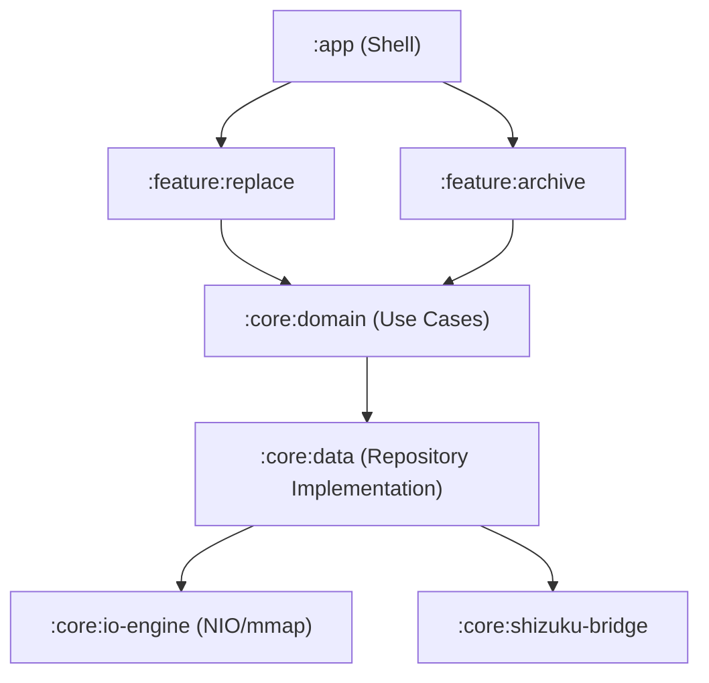

# V12.0.0 领域驱动设计 (DDD) 与多模块重构指南

## 1. 核心思想
打破以“页面”为中心的结构，迁移到以“业务能力”为核心的模块化架构。

## 2. 预想模块拓扑图

## 3. 模块职责说明书

### `:core:io-engine`
- **内容**: `IoOptimizer`, `FileHasher`, `SpeedCalculator`。
- **目标**: 纯 Kotlin/Native 逻辑，无任何 Android 依赖，确保极致的单测运行速度。

### `:core:domain`
- **内容**: 业务逻辑接口（Interface）。
- **示例**: `ReplaceFilesUseCase`, `VerifyIntegrityUseCase`。
- **原则**: 不允许 import `android.*`，这是项目的灵魂。

### `:core:shizuku-bridge`
- **内容**: 处理与 Shizuku 服务的 AIDL 通讯、生命周期绑定。
- **隔离**: 将所有 IPC 的复杂性屏蔽在模块内。

## 4. 迁移路线
1.  **抽离 Core**: 首先将 `utils/` 下的工具类移动到 `:core:common`。
2.  **定义 Domain**: 在 `com.example.tfgwj.domain` 下定义所有业务动作。
3.  **反向依赖**: 让现有代码依赖 Domain 接口，使用 Hilt 或 Koin 进行注入。
